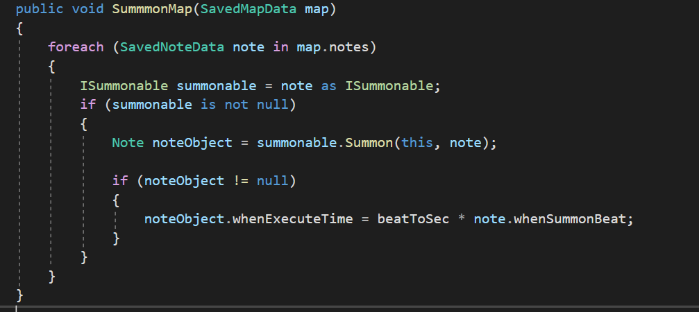

# is, as 키워드

---

C#의 is, as 키워드는 캐스팅을 위해 사용되는 키워드입니다.

## is 키워드

---

is 키워드는 객체를 특정 타입으로 캐스팅 할 수 있는지 확인해 bool타입으로 반환합니다.

```csharp
class DataA { }

class DataB : DataA { }

DataA a = new DataA();
DataB b = new DataB();

Debug.Log(a is DataA);  //true
Debug.Log(b is DataB);  //true
Debug.Log(b is DataA);  //true
Debug.Log(a is DataB);  //false
```

- is 키워드는 enum, struct등의 값 타입의 캐스팅을 확인할 때도 사용할 수 있다.
- 익명메서드등의 일부 예외는 is 키워드를 사용할 수 없습니다.
- 사용자 정의 형변환은 is 키워드의 결과에 영향을 주지 않습니다.
- is 대신 is not을 사용함으로서 결과에 부정 연산을 더할 수 있습니다.
- 확인할 타입 대신 null을 넣으면 객체가 null인지 확인합니다.

## as 키워드

---

as 키워드는 참조 타입 객체를 안전하게 캐스팅합니다.

객체를 특정 타입으로 캐스팅해 반환하고, 캐스팅이 실패한다면 null을 반환합니다.

```csharp
class DataA { }

class DataB : DataA { }

DataA a = new DataA();
DataB b = new DataB();

DataB newA = a as DataB;  //캐스팅이 실패해 null 대입
DataA newB = b as DataA;  //캐스팅에 성공해 b대입
```

- 익명메서드등의 일부 예외는 as 키워드를 사용할 수 없습니다.
- 사용자 정의 형변환은 as 키워드의 결과에 영향을 주지 않습니다.
- 캐스팅 실패시 null을 반환하기 때문에 NullAble형식으로 반환해야 합니다.

## 사용예시

리듬게임 프로젝트의 맵 데이터를 읽어 노트를 소환하는 함수이다.



note변수에 저장된 노트가 ISummonalbe 타입으로 변환이 가능하다면

(as로 캐스팅한 결과가 null이 아니라면)

Summon 함수를 호출한다.