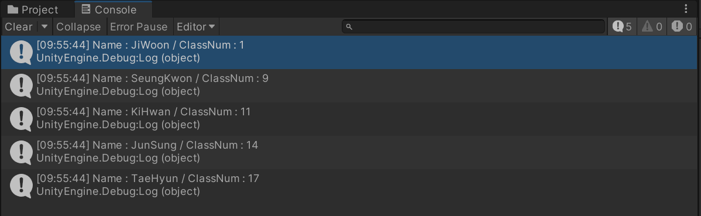

# LINQ

LINQ란 Language Integrated Query의 약자로, 특정 데이터에서 쿼리식을 통해 원하는 데이터를 빠르고 편리하게 추출하는 방식이다. 여기서 쿼리(Query)란 질문하여 밝힌다는 의미로 쉽게 말해 데이터에 대해 질문하고, 그 질문을 통해 원하는 데이터를 찾는 것을 말한다.

쉽게 말해 배열, 컬렉션 등에서 내가 원하는 데이터만 가져오고 싶을 때 사용할 수 있는게 LINQ다.

# 키워드

| 키워드 | 설명 |
| --- | --- |
| from | 원하는 데이터를 추출할 데이터 소스를 지정한다. |
| where | 하나 이상의 bool 식을 기준으로 추출할 데이터의 조건을 지정한다. |
| select | 추출할 데이터를 지정한다. |
| group | 지정한 조건에 따라 데이터를 그룹화한다. |
| into | join, group, select 절의 결과에 대한 참조로 사용할 수 있는 식별자를 제공합니다. |
| orderby | 오름차순 또는 내림차순으로 데이터를 정렬한다. |
| join | 지정한 두 데이터 사이에서 일치한 데이터들만 연결한다. |
| let | 쿼리 식 내에서 사용 가능한 변수를 생성한다. |
| in | from 절과 join절에서 선언한 데이터 소스가 참조할 원본 데이터를 지정한다. |
| on | join 절에서 두 데이터가 같은지 비교한다. |
| equals | join 절에서 두 데이터를 비교한다. |
| by | group 절에서 데이터의 그룹화 조건을 지정한다. |
| ascending | orderby 절에서 데이터를 오름차 순으로 정렬한다. (기본) |
| descending | orderby 절에서 데이터를 내림차 순으로 정렬한다. |

# LINQ 사용예시

## from - where - select

가장 기본적인 쿼리식으로 학생 클래스 배열를 생성한 뒤 where 키워드를 사용해 1반인 학생 데이터만 추출하였다.

```csharp
using UnityEngine;
using System.Linq;

public class LINQ_Example : MonoBehaviour
{
    class Student
    {
        public string Name { get; set; }
        public int ClassNum { get; set; }
    }

    Student[] students = new Student[]
    {
        new Student() { Name = "JunSung", ClassNum = 1 },
        new Student() { Name = "SeungKwon", ClassNum = 1 },
        new Student() { Name = "TaeHyun", ClassNum = 1 },
        new Student() { Name = "JiWoon", ClassNum = 3 },
        new Student() { Name = "KiHwan", ClassNum = 4 }
    };

    private void Awake()
    {
        var filteredStudents = from student in students
                               where student.ClassNum == 1
                               select student;

        foreach (var filteredStudent in filteredStudents)
        {
            Debug.Log("Name : " + filteredStudent.Name + " / ClassNum : " + filteredStudent.ClassNum);
        }
    }
}
```


## orderby

orderby 키워드를 통해 학생 클래스 배열에서 학생 데이터를 번호 순차별로 정리하였다.

```csharp
using UnityEngine;
using System.Linq;

public class Test : MonoBehaviour
{
    class Student
    {
        public string Name { get; set; }
        public int Number { get; set; }
    }

    Student[] students = new Student[]
    {
        new Student() { Name = "JunSung", Number = 14 },
        new Student() { Name = "SeungKwon", Number = 9 },
        new Student() { Name = "TaeHyun", Number = 17 },
        new Student() { Name = "JiWoon", Number = 1 },
        new Student() { Name = "KiHwan", Number = 11 }
    };

    private void Awake()
    {
        var filteredStudents = from student in students
                               orderby student.Number // (기본)ascending, descending
                               select student;

        foreach (var filteredStudent in filteredStudents)
        {
            Debug.Log("Name : " + filteredStudent.Name + " / ClassNum : " + filteredStudent.Number);
        }
    }
}
```

### ascending(오름차 순) 사용 시



### descending(내림차 순) 사용


## group - by

group, by 키워드로 학생 클래스 배열에서 1반인 학생과 아닌 학생을 그룹화 하여 정리하였다.

```csharp
using UnityEngine;
using System.Linq;

public class Test : MonoBehaviour
{
    class Student
    {
        public string Name { get; set; }
        public int ClassNum { get; set; }
    }

    Student[] students = new Student[]
    {
        new Student() { Name = "JunSung", ClassNum = 1 },
        new Student() { Name = "SeungKwon", ClassNum = 1 },
        new Student() { Name = "TaeHyun", ClassNum = 1 },
        new Student() { Name = "JiWoon", ClassNum = 3 },
        new Student() { Name = "KiHwan", ClassNum = 4 }
    };

    private void Awake()
    {
        var filteredStudents = from student in students
                               group student by student.ClassNum == 1 into classOneStudent
                               select classOneStudent;

        foreach (var filteredStudent in filteredStudents)
        {
            foreach (var student in filteredStudent)
            {
                Debug.Log("Name : " + student.Name + " / Is ClassOne? : " + filteredStudent.Key);
            }
        }
    }
}
```


## join - on - equals

join, on, equals 키워드를 사용해 학생 클래스 배열에서 같은 반인 선생님 데이터를 연결시켰다.

```csharp
using UnityEngine;
using System.Linq;

public class Test : MonoBehaviour
{
    class Student
    {
        public string Name { get; set; }
        public int ClassNum { get; set; }
    }

    class Teacher
    {
        public string Name { get; set; }
        public int ClassNum { get; set; }
    }

    Student[] students = new Student[]
    {
        new Student() { Name = "JunSung", ClassNum = 1 },
        new Student() { Name = "SeungKwon", ClassNum = 1 },
        new Student() { Name = "TaeHyun", ClassNum = 1 },
        new Student() { Name = "JiWoon", ClassNum = 3 },
        new Student() { Name = "KiHwan", ClassNum = 4 }
    };

    Teacher[] teachers = new Teacher[]
    {
        new Teacher() { Name = "MyoungSeo", ClassNum = 1 },
        new Teacher() { Name = "EunJung", ClassNum = 2 },
        new Teacher() { Name = "MiSo", ClassNum = 3 },
        new Teacher() { Name = "JiHyun", ClassNum = 4 }
    };

    private void Awake()
    {
        var filteredStudents = from student in students
                               join teacher in teachers on student.ClassNum equals teacher.ClassNum
                               select new { Name = student.Name, teacher = teacher.Name };

        foreach (var filteredStudent in filteredStudents)
        {
            Debug.Log("Name : " + filteredStudent.Name + " / teacher : " + filteredStudent.teacher);
        }
    }
}
```


## let

let 키워드를 사용하여 쿼리식 중간에 변수를 생성한 뒤 학생 클래스 변수에서 J로 이름이 시작하는 학생 데이터를 추출하였다.

```csharp
using UnityEngine;
using System.Linq;

public class Test : MonoBehaviour
{
    class Student
    {
        public string Name { get; set; }
        public int ClassNum { get; set; }
    }

    Student[] students = new Student[]
    {
        new Student() { Name = "JunSung", ClassNum = 1 },
        new Student() { Name = "SeungKwon", ClassNum = 1 },
        new Student() { Name = "TaeHyun", ClassNum = 1 },
        new Student() { Name = "JiWoon", ClassNum = 3 },
        new Student() { Name = "KiHwan", ClassNum = 4 }
    };

    private void Awake()
    {
        var filteredStudents = from student in students
                               let firstJName = student.Name
                               where firstJName.StartsWith("J")
                               select firstJName;

        foreach (var filteredStudent in filteredStudents)
        {
            Debug.Log("First J Name : " + filteredStudent);
        }
    }
}
```


# 장단점

## 장점

- 컴파일 시간에 타입을 체크하기에 런타임 전 에러 사항을 확인할 수 있다.
- 반복문, 조건문 보다 코드의 가독성이 좋아진다.

## 단점

- 일반적으로 for, foreach보다 느리다

# LINQ를 공부하면서

- 예시가 많지 않아서 약간 어려웠다.
- 키워드에 대한 설명도 안보여서 공식사이트에 갔는데 번역이 개같아서 직접 썼다.