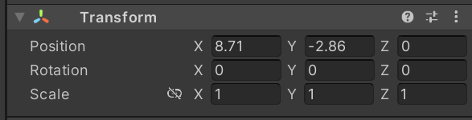
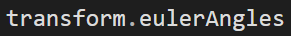
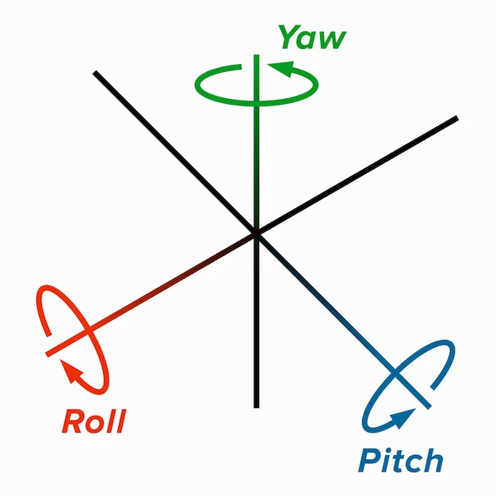
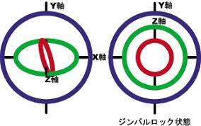
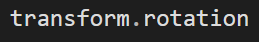
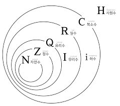
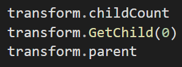
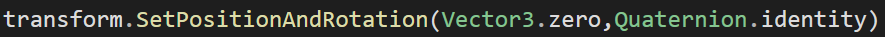

# 유니티의 트랜스폼 컴포넌트

트랜스폼 컴포넌트는 게임 오브젝트에 필수적인 컴포넌트로, 게임 오브젝트를 생성하면 기본적으로 장착되어있고, 게임 오브젝트가 존재하는 동안 절대로 파괴할 수 없다.

트랜스폼은 **위치, 방향, 크기, 부모 자식관계** 정보를 저장한다.

## 트랜스폼의 방향

트랜스폼의 방향 기능은 직관적인 위치, 크기 정보보다 난해하다.

일단 방향은 인스펙터에서 Vector3 타입으로 표기된다.

하지만 코드에서 실제 타입은 **Quaternion 타입**으로 사용된다.

### 오일러 각

각 축을 기준으로 하는 3개의 회전을 통해 3차원 회전을 표현한다.

$x$값이 바뀔경우에는 $x$축을 기준으로, $y$은 $y$축 기준으로 회전한다.

### 짐벌락

하지만 오일러각은 특정 축이 $90\degree$로 회전할 때 여러개의 축이 겹쳐져 회전 반경이 제한되는 짐벌락 현상이 발생해 문제가 있다. 이런 문제때문에 유니티에서는 사원수를 통해 회전을 표현한다.

### Quaternion(사원수)

사원수는 복소수를 확장하여 만들어진 수 체계이다.

사원수는 유니티에서 곱셈을 통해 방향과 회전을 표현할때 쓰이며, 다음과 같은 특징을 가진다.

- 사원수끼리 곱하면 두 회전을 더한 회전값이 나온다.
- 사원수와 벡터를 곱하면 벡터를 사원수값만큼 회전시킨 벡터를 반환한다.
- 곱셈의 결합 법칙이 성립한다.
- **곱셈의 교환 법칙이 성립하지 않는다.**
- 사원수의 곱셈은 덧셈과 곱셈만으로 이루어져있어 **빠르다**.

## 트랜스폼의 부모자식 관계

트랜스폼은 게임 오브젝트간의 부모 자식관계도 저장한다.

게임 오브젝트가 아닌 트랜스폼에 부모 자식관계를 저장하는 이유는 수학에서 트랜스폼의 의미를 알면 대충 추측할 수 있다.

### 수학에서의 트랜스폼

수학에서 트랜스폼은 물체를 배치할 수 있는 로컬 공간을 구현하는데 쓰이는 데이터를 저장한다.

트랜스폼을 통해 생성된 로컬 공간에는 자신이 가진 메시의 정점들이 배치되고, 자식 오브젝트의 트랜스폼을 통해 생성된 로컬 공간이 배치될 수도 있다.

부모 게임 오브젝트가 존재한다는건 자신의 로컬 공간이 부모 게임 오브젝트의 로컬 공간에 속한다는 뜻이기 때문에 로컬 공간을 저장하는 트랜스폼이 부모 자식 관계를 같이 저장한다고 볼 수 있다.

## SetPostionAndRotation 메서드

트랜스폼의 위치, 방향, 크기중 하나가 바뀔때마다 트랜스폼은 정보가 바뀌었다는 신호를 보내고 로컬 공간을 다시 계산한다.

좌표와 회전이 동시에 변화하는 경우에는 trasform.SetPostionAndRotation 메서드를 통해 변화시키면 성능을 향상시킬 수 있다.

## 참고자료

https://www.youtube.com/watch?v=QtmGT-22PqA