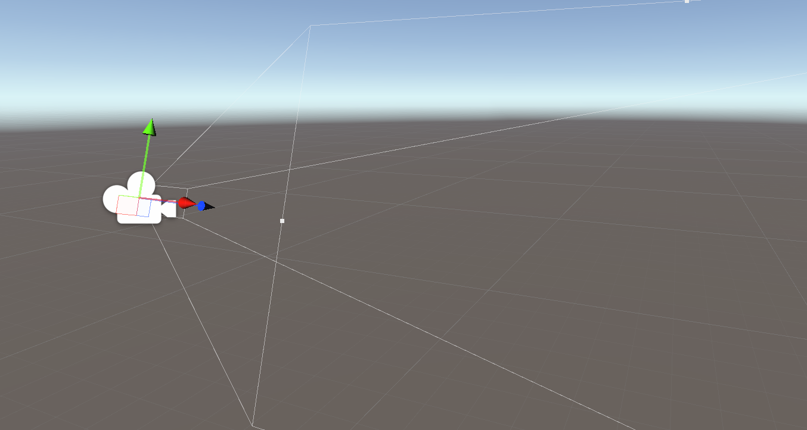
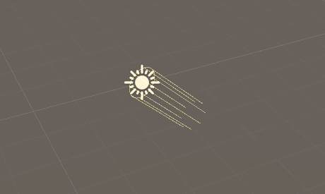
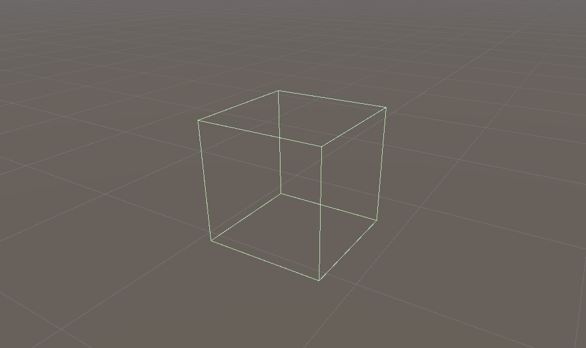
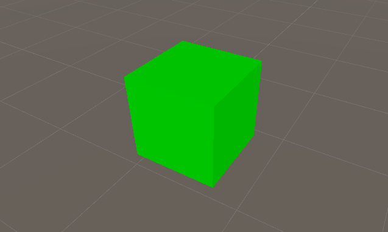
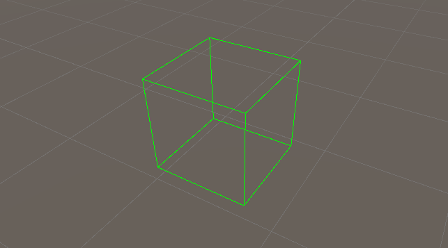
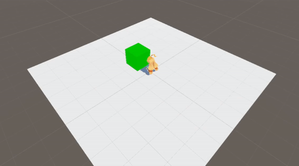

# OnDrawGizmos

# OnDrawGizmos 란?

OnDrawGizmos는 MonoBehaviour 클래스에서 지원하는 함수로 유니티 에디터의 씬 화면에서 직접  기즈모를 그려서 시각적으로 디버깅을 도와주는 함수이다. 단 게임 화면에선 보이지 않기 때문에 씬 화면에서 기즈모를 확인해야한다.

## 기즈모란?

씬 화면에 존재하는 게임 오브젝트와 연관된 그래픽스로 해당 게임 오브젝트의 정보를 시각적으로 보여주는 장치이다.

# 유니티에서 볼 수 있는 Gizmos 예시

## 카메라 기즈모



## Light Direction 기즈모



## 콜라이더 기즈모



# OnDrawGizmos 사용 방법

```csharp
using UnityEngine;

// OnDrawGizmos 함수를 사용하기 위해선 MonoBehaviour 클래스를 상속받아야 한다.
public class OnDrawGizmosTest : MonoBehaviour
{
		// OnDrawGizmos 함수 선언
    private void OnDrawGizmos()
    {
				// 기즈모 색상 설정
        Gizmos.color = Color.white;
				// 기즈모 종류 설정
        Gizmos.DrawCube(transform.position, new Vector3(1, 1, 1));
    }
}
```

## 기즈모 종류

- Gizmos.DrawCube : 박스 형태의 기즈모를 그린다.
- Gizmos.DrawSphere : 구 형태의 기즈모를 그린다.
- Gizmos.DrawRay : 레이 형태의 기즈모를 그린다.
- Gizmos.DrawMesh : 원하는 메쉬 형태의 기즈모를 그린다.

## Wire 기즈모

Cube, Sphere, Mesh는 각각 DrawWireCube, DrawWireSphere, DrawWireMesh 로도 기즈모를 그릴 수 있다. 이 함수들을 사용해 기즈모를 그릴 경우 모서리만 그려진 형태의 기즈모를 그릴 수 있다.

### DrawCube와 DrawWireCube의 차이 예시





## OnDrawGizmosSelected

OnDrawGizmosSelected 함수는 Hierarchy 창에서 오브젝트를 선택했을 시에만 기즈모를 그리는 함수이다.

# OnDrawGizmos 사용 예시

플레이어의 앞에 공격범위가 기즈모로 보이도록 OnDrawGizmos 함수를 사용하여 구현하였다.

```csharp
using UnityEngine;

public class Player : MonoBehaviour
{
		// 속도, 공격범위 변수 선언
    public float speed;
    private Vector3 atkSize = new Vector3(1,1,1);

		// 플레이어 이동
    private void Update()
    {
        float x = Input.GetAxisRaw("Horizontal") * speed * Time.deltaTime;
        float z = Input.GetAxisRaw("Vertical") * speed * Time.deltaTime;

        transform.Translate(new Vector3(x, 0, z));
    }

		// 플레이어의 앞에 DrawCube 함수 사용
    private void OnDrawGizmos()
    {
        Gizmos.color = Color.green;
        Gizmos.DrawCube(transform.position + transform.forward.normalized, atkSize);
    }
}
```

## 결과



# OnDrawGizmos를 공부하면서

- 다시 복습해보는 좋은 기회였다.
- 기즈모라는 단어가 단순히 OnDrawGizmos에서 그린 그래픽스만을 뜻하는 단어인줄 알았는데 기본적으로 유니티에서 여러 게임 오브젝트의 정보를 그린 그래픽스를 기즈모라 하는 것을 알게 되었다.