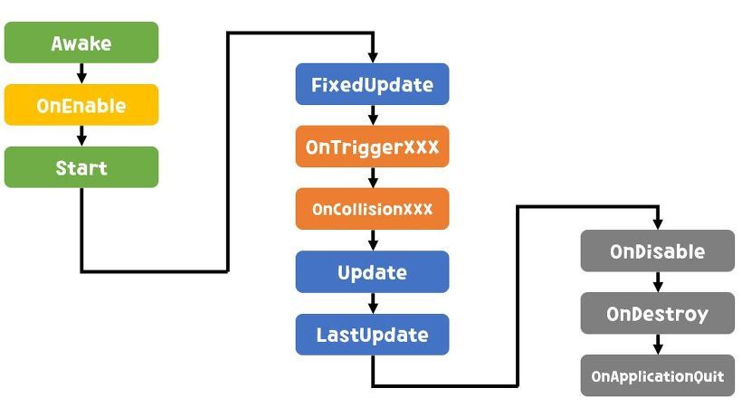

# 유니티 생명주기란?

유니티 생명주기란 이벤트 함수의 실행 순서를 뜻한다

## ***첫 씬 로드***

---

* Awake()

    > **프리펩이 인스턴스화** 된 직후에 호출된다.
    + 오브젝트가 비활성 상태라면 활성화 될때까지 호출되지 않는다.
    + 컴포넌트를 넣어줄때 사용한다

* OnEnable()

    >**오브젝트 활성화** 직후 호출된다.

## ***에디터***

---

* Reset()

    >오브젝트에 처음 연결하거나 **Reset커맨드를 사용**할 때
    **스크립트의 프로퍼티(property)를 초기화**할때 호출된다.

* OnValidate()

    >**스크립트의 프로퍼티(인스펙터 창)가 설정**될 때마다 호출된다.

## ***첫프레임 업데이트 전***

---

* Start()

    >**스크립트 인스턴스가 활성화**된 경우에만 첫 번째 프레임 업데이트 전에 호출된다.

## ***업데이트 순***

---

* FixedUpdate()

    >**Fixed Timestep**에 설정된 값에 호출된다.

    + FixedUpdate()는 주기가 일정하기 때문에 자주 이용한다. (기본값 = 0.02)
    + 연산에 주로 사용된다.

* Update()

    >**프레임**당 한번씩 호출된다.

* LateUpdate()

    >**Update()가 끝난 후 프레임**당 한번씩 호출된다.

* OnTrigger,OnCollision

    >**오브젝트간의 충돌**이 일어날때 호출된다.

## ***삭제***

---

* OnDisable()

    >오브젝트 비활성화시 호출된다.
    + 스테이지 클리어시 시간을 멈췄다가 스테이지 클리어 UI가 사라지면 다시 시간이 흐르게 지나게 하는 작업을 하는데 사용합니다.

* OnDestroy()

    >오브젝트 생존기간의 마지막 프레임이 업데이트 된 후 호출된다.
    + 적 오브젝트가 부서졌을때 플레이어의 점수를 오르게 하는데 사용합니다.

* OnApplicationQuit()

    >응용프로그램 종료 전에 모든 오브젝트에서 호출된다.
    + 게임이 모두 끝났을때 게임의 데이터를 서버로 전송해 저장시킨다.

