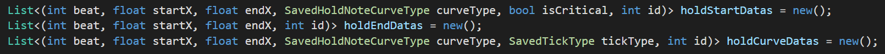

# 튜플

튜플은 한번에 여러 개의 변수를 **값 타입**으로 저장하는 타입을 생성하는 문법이다.

## 활용법

메서드가 한번에 여러 정보를 반환하게 만들 수 있다.

## 튜플 생성

튜플은 소괄호로 묶어서 표현하며,

튜플 타입을 선언할때도 저장할 타입들을 소괄호와 반점으로 묶어 표현한다.

```csharp
(int, int) a = (1, 4);   //int 타입을 두개 저장하는 타입을만들어 값을저장한다.
var b = ("이름", 5);     //(string, int) 타입을 유추할수있다.
```

## 필드의 이름

필드의 이름은 기본적으로 Item1 부터 입력된 순서대로 점점 숫자가 커지는 형태로 배정된다.

이 필드 이름들은 직접 지정할 수 있다.

```csharp
//입력순서에 맞춰 필드의 이름이 지정된다.
(string name, int age) a = ("학생", 15);

//(string name, int age) 타입임을 유추할수있다.
var b = (name: "학생", age: 15);

//타입과 값의 이름이 충돌할경우 타입의 이름이 적용된다. (name,age)
(string name, int age) c = (id: "abcd", password: 1234);
```

### 튜플 할당과 비교

튜플은 int 와 float등 암시적으로 변환이 가능한 타입은 할당과 비교가 가능하다.

## 튜플 분해

튜플의 필드에 들어있는 값들을 여러 개의 변수에 각각 할당할 수 있다.

```csharp
//새로운 변수에 값 할당
(int a, int b) = (2, 5);

//이미 존재하는 변수에 값 할당
int c, d;
(c, d) = (4, 2);
```

## 튜플의 활용

### Swap 구현

```csharp
int a = 1, b = 2;
(a, b) = (b, a);

print(a + "," + b)   //2,1
```

튜플을 활용해 간단하게 Swap을 구현할 수 있다.

### 구조체 대체



- 용도 : 정보 여러 개를 동시에 저장 or 전달이 필요할 때 사용
- 장점 : 구조체 이름짓기 귀찮을 때 편하고, 잠깐 사용하고 안쓸 데이터 형태에 쓰기 좋음

### 함수의 여러 정보 반환

```csharp
(int add, int multiple) Calculate(int a,int b)
{
		return new(a + b, a * b);
}
```

튜플 최대 장점.

구조체나 out 키워드를 쓰지 않고 여러 개의 정보를 반환하는 함수를 만들 수 있다.
