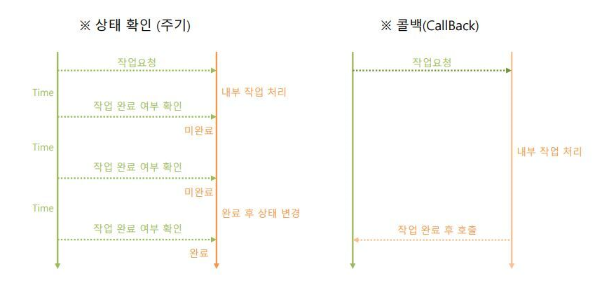

# 대리자

## Delegate

- 메서드를 참조하는 객체로, 참조하는 메서드의 입력 매개변수와, 반환 타입을 포함한다
- 델리게이트는 명시적으로 정의되어야 하며, 호출하려는 메서드의 입력 매개변수와 반환 타입을 가져야 한다
- 반환값은 마지막으로 호출된 메서드가 돌려준 값을 받는다, 이전 메서드들의 반환값은 폐기된다
- 모든 대리자는 대리자 체인을 만들 수 있다


## Func

- 반환 타입이 void가 아닌 0 ~ n개의 매개변수인 메서드를 포함하는 제네릭 델리게이트이다
- 여러 개의 메서드를 한 번에 실행시킬 수 있다

## Action

- 반환 타입이 void인 메서드를 위해 설계된 제네릭 델리게이트이다
- 여러 개의 메서드를 한 번에 실행시킬 수 있다

## Lamda

- 원하는 기능의 메서드를 직접 선언하지 않고도 만들 수 있다
- 대리자를 간단하게 만들 수 있다

---

### 콜백

- 비동기 메서드 A를 호출해 줄 때, 비동기 메서드 A가 충족될 때 실행할 메서드를 인자로 넘겨서 실행해 준다.



### 대리자 체인

- 여러가지 메서드를 등록, 삭제 할 수 있다
- 등록된 메서드를 순서대로 호출한다, 먼저 호출된 메서드가 종료된 후에, 다음 메서드가 실행된다

### 대리자 이벤트

- 작업의 실행을 알린다
- 사용자 조작 또는 속성의 값 변경이 일어났을 때, 상태들의 변화가 필요한 외부 함수에 전달해 주는데 유용하다
- 할당 연산자 사용  불가

# 코드

---

### delegate
```csharp
using System.Collections;

 using System.Collections.Generic;
 
 using UnityEngine;
 
 public class Base : MonoBehaviour
 
 {
 
 public delegate void MyDelegate(int i);//델리게이트 선언
 
 MyDelegate myDelegate;
 
 void Start()
 
 {
 
 myDelegate += Print;//메서드 추가
 
 myDelegate();
 
 }
 
 public void Print()
 
 {
 
 Debug.Log(”hello, world”);
 
 }
 
 }//결과 : hello, world
 ``` 

### func

```csharp
using System.Collections;
 
 using System.Collections.Generic;
 
 using UnityEngine;
 
 using System;
 
 public class Base : MonoBehaviour
 
 {
 
 Func<bool> myFunc;//대리자 선언
 
 void Start()
 
 {
 
 myFunc += Func1;//메서드 추가
 
 myFunc += Func2;//메서드 추가
 
 if(myFunc())
 
 {
 
 Debug.Log(”Func True”);
 
 }
 
 Debug.Log(myFunc());
 
 }
 
 public bool Func1()
 
 {
 
 return true;
 
 }
 
 public bool Func2()
 
 {
 
 return false;
 
 }
 
 }//결과 : Func True
                false 
```

### action

```csharp
using System.Collections;
 
 
 using System.Collections.Generic;
 
 using UnityEngine;
 
 using System;
 
 public class Base : MonoBehaviour
 
 {
 
 Action myAction;//대리자 선언
 
 void Start()
 
 {
 
 myAction += Action_A;//메서드 추가
 
 myAction += Action_B;//메서드 추가
 
 myAction += Action_C;//메서드 추가
 
 myAction();
 
 }
 
 public void Action_A()
 
 {
 
 Debug.Log(”Action_A”);
 
 }
 
 public void Action_B()
 
 {
 
 Debug.Log(”Action_B”);
 
 }
 
 public void Action_C()
 
 {
 
 Debug.Log(”Action_C”);
 
 }
 
 }// 결과 : Action_A
 
           Action_B
 
          Action_C
``` 

### lamda

```csharp
using System.Collections;
 
 
 using System.Collections.Generic;
 
 using UnityEngine;
 
 public class Base : MonoBehaviour
 
 {
 
 delegate int MyDelegate(int x, int y);
 
 void Start()
 
 {
 
 MyDelegate myDelegate = (x, y) ⇒ x + y;
 
 int a = myDelegate(1,1);
 
 Debug.Log(a);
 
 }
 
 }//결과 : 2
```