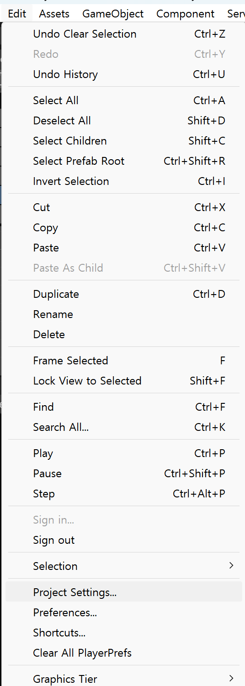
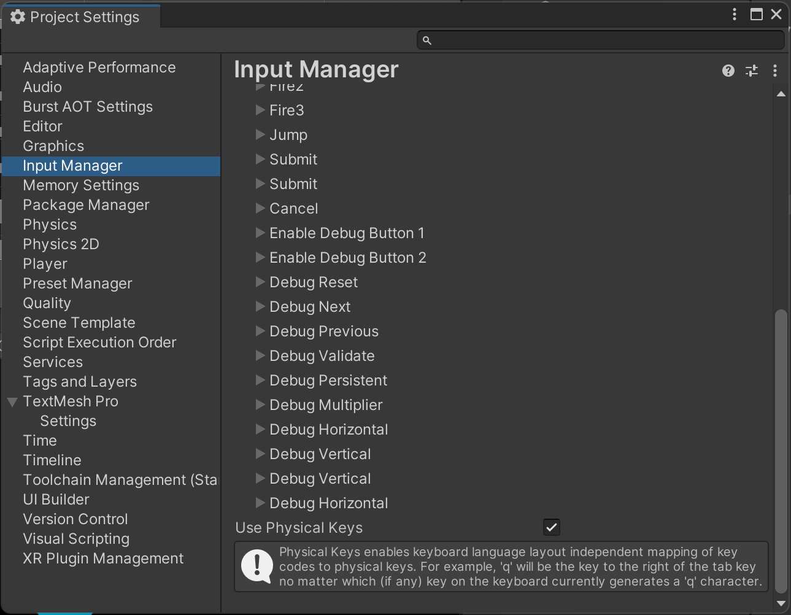
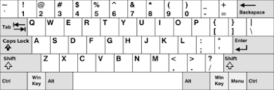
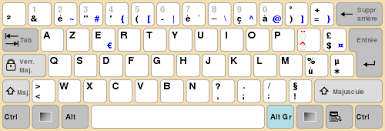
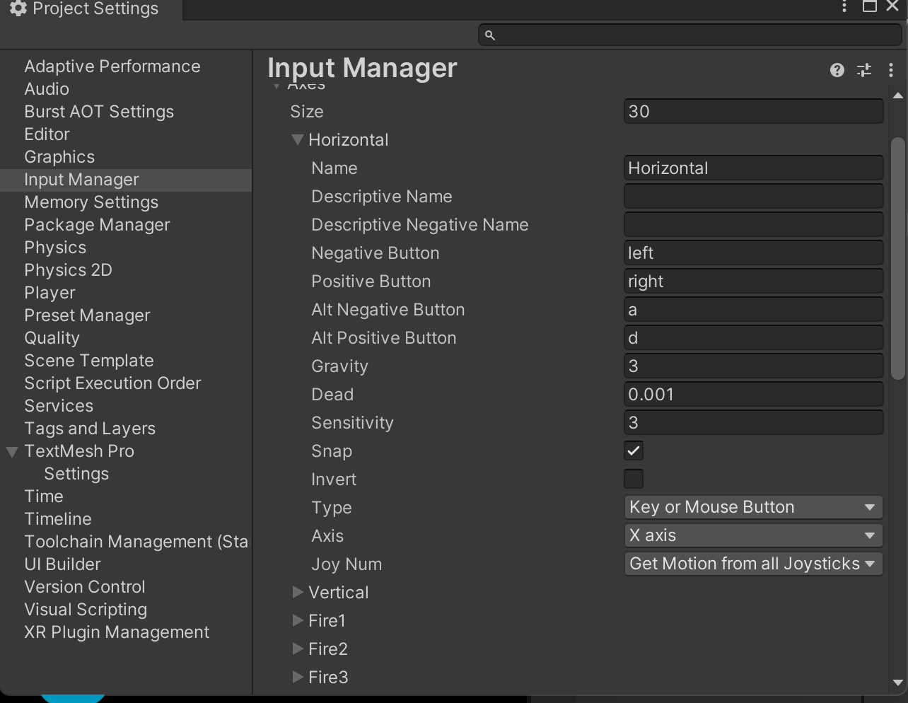

### 유니티 입력 타입

- 키보드 및 마우스
- 조이스틱
- 컨트롤러
- 터치 스크린
- 모바일 기기의 움직임 감지 기능(가속 센서 또는 자이로스코프)
- VR 및 AR 컨트롤러

### 입력 지원

- 입력 관리자
- 입력 시스템

### 입력 관리자

**입력 종류**

- 키 : 물리적 키보드의 모든 키(예 : W, Shift, Space bar 등)
- 버튼 : 물리적 컨트롤러에 있는 버튼(예 : 게임 패드)
- 가상 축 : 버튼, 키 등과 같은 컨트롤에 매핑됨. 사용자가 컨트롤을 활성화 하면 축은 [-1, 1] 범위의 값을 수신함.

### 옵션

**Use Physical Keys**

이 옵션을 사용하면 언어별 레이아웃이 아 물리 키보드 레이아웃에 키 코드를 매핑할 수 있다.

- 예) QWERTY와 AZERTY 키보드가 있다고 할 때 이동 키로 WASD를 사용하게 스크립트를 짜면 AZERTY에서는 의도하지 않은대로 설정된다. 하지만 여기서 이 옵션을 활성화 시키면 ANSI/ISO QWERTY 레이아웃을 사용해서 실제 레이아웃과 관계없이 키의 물리적 위치로써 동작하게된다.

### **가상 축**

생성되는 모든 프로젝트에 기본적으로 여러 입력 축이 생성되어 있는데 이 축을 사용해서 키보드, 마우스, 조이스틱입력을 바로 사용할 수 있다.

**Properties**

Name : 축의 이름(스크립트에서 축에 액세스할 때 사용)

Descriptive Name, Descriptive Negative Name : 현재는 지원하지 않지만 이전에는 시작 시 Rebind Controls 화면에서 사용자에게 표시되었었는데, 이 화면도 지원이 중지됨

Negative Button, Positive Button : 축의 음과 양의 방향으로 미는 데 사용하는 컨트롤

Alt Negative Button, Alt Positive Button : 축의 음과 양의 방향으로 미는데 사용하는 대체 컨트롤

Gravity : 아무 입력도 없을 때 중립으로 떨어지는 속도(초)

Dead : 이 수치 이내의 값은 모두 0으로 처리(조이스틱에서만)

Sensitivity :  축이 대상의 값으로 향하기 위한 속도(초)

Snap : 반대되는 입력을 받은 경우 즉시 0으로 초기화 함

Invert : 값 반전(양⇒음, 음⇒양)

Type : 축을 제어하는 입력 타입(키 또는 마우스버튼, 마우스 이동, 조이스틱 축)

Axis : 축을 제어하는 연결된 기기의 축

Joy Num : 축을 제어하는 연결된 기기의 조이스틱(특정 조이스틱 또는 모든 조이스틱)에서 입력을 쿼리 가

**가상 축 추가, 제거, 복사**

- 추가 : Size 값을 높인다
- 제거 : Size 값을 줄이거나, 축을 오른쪽 클릭해 Delete Array Element를 선택한다
- 복사 : 축을 오른쪽 클릭해 Duplicate Array Element를 선택한다

**가상 축에 컨트롤 매핑**

문자 키 : a, b, c …

숫자 키 : 1, 2, 3 …

화살표 키 : up, down, left, right

숫자패드 키 : [1], [2], [3], [+], [equals] …

수정 키 : right shift, left shift, right ctrl, left ctrl, right alt, left alt, right cmd, left cmd

특수 키 : backspace, tab, return, escape, space, delete, enter, insert, home, end, page up, page down

기능 키 : f1, f2, f3 …

마우스 버튼 : mouse 0, mouse 1, mouse 2 …

조이스틱 특정 버튼 : joystick button 0, joystick button 1, joystick button 2 …

특정 조이스틱의 특정 버튼 :  joystick 1 button 0, joystick 1 button 1, joystick 2 button 0 …

### 정적 변수

R = 읽기 전용, T = 임시 변수 할당, H = 휴대용 장치에만 해

acceleration : 3차원 공간에서 마지막으로 측정된 선형 가속도(R)

accelerationEventCount : 마지막 프레임 동안 발생한 가속도 측정 횟수

accelerationEvents : 마지막 프레임 동안 발생한 가속도 측정 목록(R, T)

anyKey : 현재 누르고 있는 키나 마우스 버튼이 있는지(R)

anyKeyDown : 사용자가 키나 마우스 버튼을 누르는 첫 번째 프레임에 true를 반환(R)

backButtonLeavesApp : 뒤로가기로 앱이 종료되는지(Android, Windows Phone, Windows 태블릿에 사용)

compass : 나침반에 액세스(R)(H)

compensateSensors : 화면 방향에 대한 입력 센서 보정 여부

compositionCursorPos : IME가 창을 여는 데 사용하는 현재 텍스트 입력 위치

compositionString : 사용자가 입력하고 있는 현재 IME 구성 문자열

deviceOrientation : OS에서 보고한 장치의 물리적 방향(R)

gyro : 기본 자이로스코프

imeCompositionMode : IME 입력 구성의 활성화 및 비활성화 제어

imelsSelected : 사용자의 IME 키보드 입력 소스 선택 여부

inputString : 해당 프레임에 입력된 키보드 입력을 반환(R)

location : 장치 위치에 액세스하기 위한 속성(R)(H)

mousePosition : 픽셀 좌표로 표시되는 현재 마우스 위치(R)

mousePresent : 마우스 장치가 감지되었는지 여부

mouseScrollDelta : 현재 마우스 스크롤 델타(R)

multiTouchEnabled : 다중 터치 처리 여부

simulateMouseWithTouches : 터치로 마우스 시뮬레이션을 활성화/비활성화한다

stylusTouchSupported : 기기나 플렛폼에서 스타일러스 터치를 지원하는지

touchCount : 터치 횟수. 프레임 전체에서 변경되지 않음(R)

touches : 마지막 프레임 동안의 모든 터치 상태를 나타내는 개체 목록을 반환(R)(T)

touchPressureSupported : 터치 압력의 지원 여부

touchSupported : 터치 입력 지원 여부

### **정적 함수**

GetAccelerationEvent : 마지막 프레임 동안 발생한 특정 가속도 측정값을 반환

GetAxis : AxisName으로 식별되는 가상 축의 값을 반환(-0.1f ~0.1f)

GetAxisRaw : AxisName으로 식별되는 가상 축의 값을 반환(-1, 0, 1)

GetButton : ButtonName으로 식별된 가상 버튼을 누르고 있는 동안 true를 반환

GetButtonDown : 사용자가 버튼 이름으로 식별되는 가상 버튼을 누른 프레임동안 true 반환

GetButtonUp : 사용자가 버튼 이름으로 식별된 가상 버튼을 놓은 첫 번째 프레임에서 true 반환

GetJoystickNames : 연결된 조이스틱을 설명하는 문자열 배열을 반환

GetKey : 사용자가 이름으로 식별되는 키를 누르고 있는동안 true반환

GetKeyDown : 사용자가 이름으로 식별되는 키를 누르기 시작하는 프레임 동안 true 반환

GetKeyUp : 사용자가 이름으로 식별된 키를 놓은 프레임동안 treu 반환

GetMouseButton : 주어진 마우스 버튼이 눌러져 있는지 여부를 반환합니다

GetMouseButtonDown : 사용자가 지정된 마우스 버튼을 누른 프레임 동안 true를 반환

GetMouseButtonUp : 사용자가 지정된 마우스 버튼을 놓는 프레임 동안 true를 반환

GetTouch : 특정 터치의 상태를 나타내는 객체를 반환

IsJoystickPreconfigured : 특정 조이스틱 모델이 Unity에서 사전 구성되었는지 확인(Linux 전용)

ResetInputAxes : 모든 입력을 재설정. ResetInputAxes 후에는 모든 축이 0으로 돌아가고 모든 버튼은 한 프레임동안 0으로 돌아니다