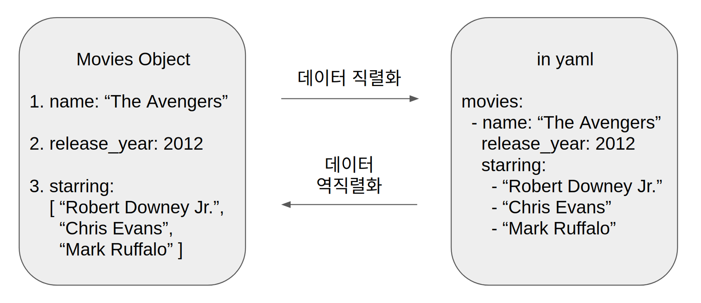
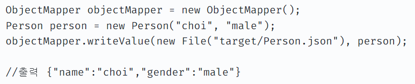
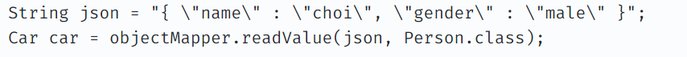
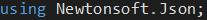

# Json

Unity Json - Unity JSON Utility | Newtonsoft.Json

### JSON이란

---

- **J**ava**S**cript **O**bject **N**otation의 약자로

      사람이 읽을 수 있는 텍스트 기반의 데이터 교환 표준이다.

- JSON은 텍스트로 이루어져 있어서 사람과 기계가 모두 이해하기 쉽고 용량이 작다.

### JSON 직렬화 / 역직렬화

---

> 직렬화 : 객체 ⇒ 문자열로 반환한다.
> 

> 역직렬화 : 문자열 ⇒ 객체로 반환한다.
> 

- 직렬화 예시

- 역직렬화 예시

### Newtonsoft.Json

---

newtonsoft.json 라이브러리를 유니티에서 사용할 수 있다.

코드에서 using Newtonsoft.Json; using 지시문을 입력해 아래의 Attribute를 사용할 수 있다.

| 예) |
| --- |
| [JsonProperty(” ”)] |
| JsonConvert.SerializeObject |
| JsonConvert.DeserializeObject |