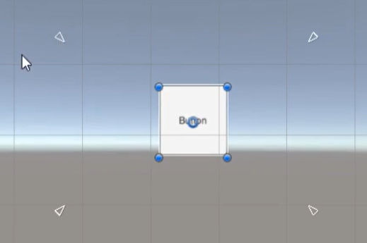
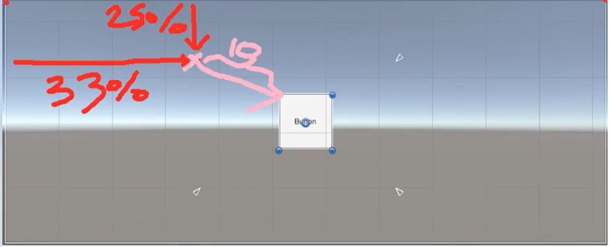
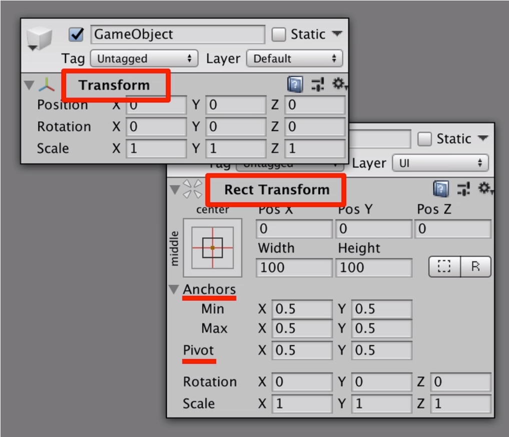
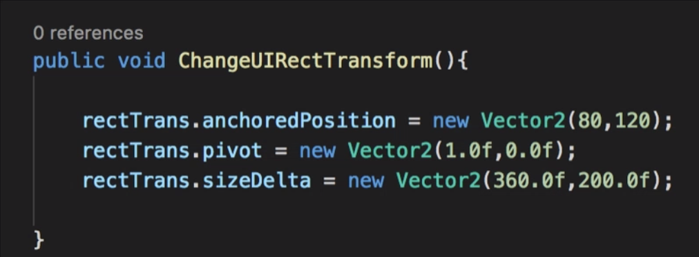

# Rect Transform

## Anchor
- anchor(닻)
    
    
    
    4개의 삼각형이 각각 UI의 꼭짓점을 가리키는데
    
- anchor 공식
    
    닻과 부모(팔레트)에 비례 해서 닻을 조정해서 UI크기를 맞춘다
    
    
    
---
- Rect transform
     

## Rect Transform

Rect transform은 일반 오브젝트와는 다르게 UI에만 있는 transform인데 UI의 위치와 크기. Anchors ,pivot(중심점)들을 사용 할 수 있다

### RectTransform객체를 만들어서 GetComponent해서 사용한 예

anchoredPosition : UI의 위치 

pivot : pivot의 위치

sizeDelta : UI의 크기

