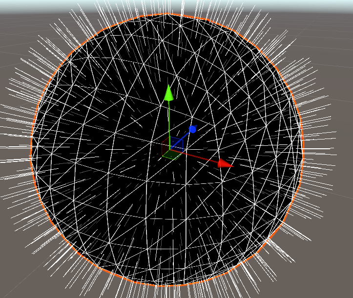

# Mesh의 렌더링 원리

---

메시는 삼각형을 조합하여 3D 데이터를 표현하는 데이터를 저장한다.

메시의 모델링을 저장하는데 쓰이는 점들을 **정점**이라고 한다.

이 정점들을 조합하여 삼각형을 그리면 모델링이 표현된다.

이렇게 표현된 모델링에 **UV데이터**와 **법선벡터**를 통해 더욱 사실적인 모델링을 표현한다.

## 법선벡터(nomal vector)

법선 벡터는 직선이나 평면에 대해 수직인 벡터를 의미한다.

메시의 삼각형에 대한 법선벡터는 조명에 따른 명암등을 표현할 떄 쓰인다.

표면의 밝기는 광원의 벡터와 표면의 법선벡터의 사잇각의 코사인값에 비례한다.

또한 표면의 법선벡터가 카메라의 방향 벡터와 $90\degree$이상 차이가 나지 않는다면 표면을 아예 표현하지 않는다.

## UV 데이터

UV 데이터는 삼각형에 텍스쳐를 채우는데 사용된다.

메시의 각 정점에는 텍스쳐내의 점의 좌표를 의미하는 $(0,0)$에서 $(1,1)$사이의 좌표가 들어있다.

삼각형을 이루는 정점에 있는 3개의 UV 좌표를 무게중심좌표계를 이용해 보간하여 삼각형에 텍스쳐를 채울 수 있다.

# 유니티의 Mesh 클래스

## Mesh 클래스의 필드

---

유니티의 정점 관련 정보는 여러개의 배열에 나뉘어 저장되어 있다.

만약 n번째 정점의 정보를 얻고자 한다면 아래와 같은 필드들을 참조할 수 있다.

- vertice[n] : n번째 정점의 **좌표**
- nomals[n] : n번째 정점의 **법선벡터**
- uv[n] : n번째 정점의 **uv**

이렇게 정점을 참조할 때, 정점의 개수를 반환하는 **vertexCount** 필드를 for문에 사용할 수 있다.

이런 정점의 정보가 모두 채워져 있다면, **triangles** 배열에 정보를 채워넣어 삼각형을 만들 수 있다.

## 삼각형 정보 채우기

triangles는 다른 정보와 다르게 int 값을 저장하는 배열로, 정점의 인덱스를 의미하는 데이터를 가진다.

0,1,2번 데이터가 하나의 삼각형을 이루고, 3,4,5번 데이터가 하나의 삼각형을 이루는 방식으로 삼각형을 저장하게 된다.

## 절차적 메시 생성

유니티의 Mesh가 어떤 방식으로 모델링을 저장하는지 안다면 역으로 원하는 모델링을 코드로 생성하거나, 기존 메시를 원하는 방식으로 변형시킬 수 있다.

유니티에서 절차적 메시 생성을 활용하는 방법은 여러가지가 있다.

### 메쉬 자르기

이미 존재하는 메시를 평면을 기준으로 하여 절단하는 기법이다.

물체가 잘리거나, 파편으로 흩어지는 등의 연출을 만들 때 적절하다.

### 변형가능한 지형

아스트로니어등 플레이어가 자유롭게 지형을 변경 가능한 게임은 메시를 다루는 방법을 알아야 한다.

### 메시 생성

리듬게임등 기존에 저장된 데이터를 참조하여 새로운 메시를 생성해야될 경우 메시를 사용하여 제작할 수 있다.

# 절차적 메시 생성의 장/단점

## 장점

- 코드를 통해 자유롭게 메시를 생성할 수 있다.
- 기존 메시를 편집하는 연출을 할 수 있다.

## 단점

- 메시의 규모에 따라 **성능**을 아주 많이요구한다.