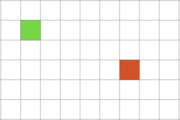
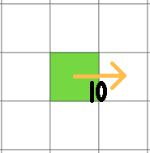
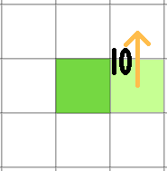
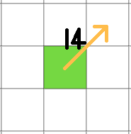
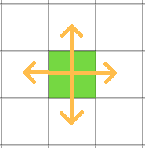
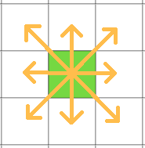
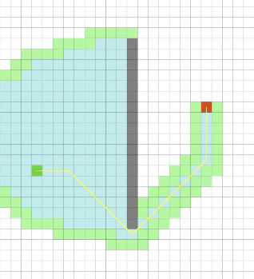
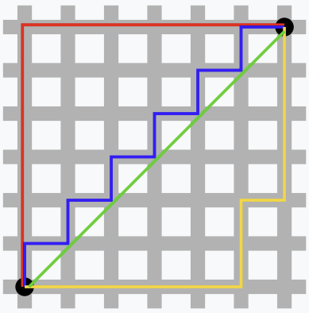

### A* 알고리즘이란?

- A* 알고리즘은 출발지에서 목적지까지 가는 최단 경로를 찾아내는 그래프 탐색 알고리즘 중 하나이다
- Dijkstra(다익스트라) 알고리즘은 모든 경로를 탐색하지만 A* 알고리즘은 필요한 경로만 탐색한다 ⇒ A* 알고리즘은 휴리스틱 추정값 $h(x)$를 매기는 방식을 사용하기 때문

### 동작 방식

1. 각각의 지점(노드)을 그리드 형태로 분할한다
    
    
    
    - 그리드 형태로 분할하는 이유
        - 이동 비용 계산의 단순화
        
        **가로 이동 비용 계산**
        
        
        
        **세로 이동 비용 계산**
        
        
        
        **대각선 이동 비용 계산**
        
        
        
        - 간단한 이웃 탐색
        
        **상하좌우 탐색**
        
        
        
        **상하좌우 및 대각선 탐색**
        
        
        
2. 출발지와 이웃한 노드의 비용을 계산하고 이전 노드를 출발지로 설정한다
    - 계산 식은 다음과 같다
        
        ${f(x) = g(x) + h(x)}$
        
        ${g(x)}$ = 출발지에서 현재 노드까지 이동하는데 드는 비용
        
        ${h(x)}$ = 현재 노드에서 도착지까지 이동하는데 드는 **예상** 비용
        
        ${f(x)}$ = 현재 노드의 최종 비용 
        
3. 노드의 좌표와 계산된 ${f(x)}$들을 ${f(x)}$를 기준으로하는 오름차순 우선순위 큐에 넣는다
4. 우선순위 큐에 들어있는 값 중 ${f(x)}$값이 가장 작은 노드(${노드N}$)와 이웃한 노드의 비용을 계산하고 이전 노드를 ${노드N}$으로 설정한 뒤 우선순위큐에서 ${노드N}$을 제거한
5. 목적지에 도착할 때까지 3~4번을 반복한다
6. 목적지에 도착했다면 목적지 노드부터 노드를 저장하고 이전 노드가 출발지가 될 때까지 이전 노드를 확인하고 저장하는 작업을 반복한다 

### 노드의 구조

- 이동가능 여부 상태값
- 그리드 상에서의 X, Y좌표
- 유니티 상의 위치값
- ${g(x)}$값, ${h(x)}$값, ${f(x)}$값
- 이전 노드

### 주요 개념

- 우선순위 큐(Priority Queue) : 일반적인 FIFO형태의 큐와 달리 들어오는 값에 우선순위를 매겨 큐에 들어오는 순서와 상관없이 우선순위를 토대로 큐에서 나간다 ⇒ 보통 구현할 때 힙을 주로 사용한다
- 휴리스틱 추정값 : 시간이 없거나 정보가 부족해서 합리적인 판단을 할 수 없거나 굳이 필요하지 않은 상황에서 보다 빠르게 계산할 수 있도록 사용하는 대략적인 값
    - 대표적인 예시로 다음과 같은 것들이 있다
    1. 맨해튼 거리(Manhattan distance, 택시 거리, ${L_1}$ 거리, 시가지 거리) 
        - 두 직선간의 수평 및 수직이동에 필요한 최소한의 거리
        - 두 지점을 (${p_1}$, ${p_2}$)와 (${q_1}$, ${q_2}$)라 할 때 두 지점 사이의 맨해튼 거리는 ${|p_1 - q_1| + |p_2 - q_2|}$이다
        - 아래의 사진에서 맨해튼 거리인 빨강, 노랑, 파랑의 길이는 모두 같다
        
        
        
    2. 유클리드 거리(Euclidean Distance)
        - 두 지점간의 직선거리
        - 두 지점을 (${p_1}$, ${p_2}$)와 (${q_1}$, ${q_2}$)라 할 때 두 지점 사이의 유클리드 거리는 ${\sqrt{(p_1 - q_1)^2 + (p_2 - q_2)^2}}$이다
        - 위 사진의 초록이 유클리드 거리이다
    3. 체비셰프 거리(Chebyshev Distance)
        - 두 지점간의 최대 축 이동 거리
        - 두 지점을 (${p_1}$, ${p_2}$)와 (${q_1}$, ${q_2}$)라 할 때 두 지점 사이의 체비셰프 거리는 ${max(|p_1 - q_1|, |p_2 - q_2|)}$이다

### 구현

1. 기즈모를 사용해서 이동가능 노드와 불가능 노드 시각화

https://blog.naver.com/PostView.naver?blogId=pkh879&logNo=221735054051&parentCategoryNo=&categoryNo=19&viewDate=&isShowPopularPosts=true&from=search

2. A* 알고리즘으로 최단경로 구하기

https://blog.naver.com/PostView.naver?blogId=pkh879&logNo=221735133223&parentCategoryNo=&categoryNo=19&viewDate=&isShowPopularPosts=true&from=search

3. 오브젝트를 목표까지 최단경로로 움직이기

https://blog.naver.com/PostView.naver?blogId=pkh879&logNo=221739293953&parentCategoryNo=&categoryNo=19&viewDate=&isShowPopularPosts=true&from=search