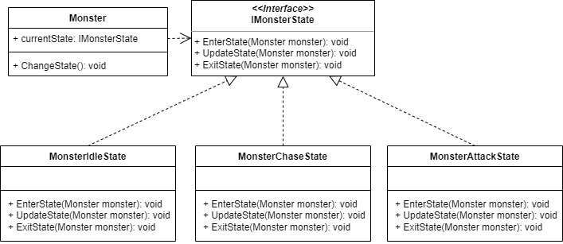
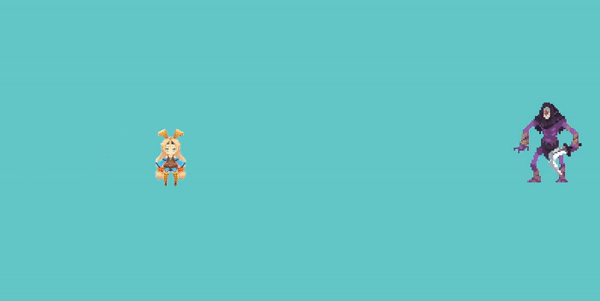

# State Pattern

# 상태 패턴이란?

상태 패턴(State Pattern)이란 객체가 특정 상태에 따라 행동을 달리하는 상황에서 각 상태들을 객체화하여 객체가 상태에게 행동을 위임하도록 하는 디자인 패턴이다.

간단한 클래스 다이어그램으로 예시를 들면

- **Monster 클래스 :** 현재 상태를 정의하고 내부 상태에 따라 현재 상태를 전환하고 현재 상태에게 행동을 위임한다.
- **IMonsterState 인터페이스 :** ConcreteState들이 행동을 위임받기 위해 구현해야할 함수들을 정의한다.
- **ConcreteState 클래스 :** Monster 클래스가 행동을 위임하기 위해 호출하는 IMonsterState 인터페이스를 구현한다.



Monster 클래스에서는 내부 상태에 따라 기본, 추적, 공격 상태로 전환된다. 이때 현재 상태를 IMonsterState 인터페이스로 선언한 뒤 원하는 상태로 전환을 해가며 현재 상태에 대한 행동은 IMonsterState에 요청한다.

상태 패턴은 여러 조건문과 플래그 변수들을 사용하면서 상태에 따른 행동들을 제어해야할 때 사용해볼 수 있다. 

# 상태 패턴 사용 예시

## 몬스터 구현 조건

### 기본 상태

- 시작 시 : 경고 표시를 비활성화 한다.
- 유지 동안 : 자신의 원래 자리로 돌아간다.
- 종료 시 : 경고 표시를 활성화 한다.

### 추적 상태

- 시작 시 : 이동 애니메이션을 활성화 한다.
- 유지 동안 : 플레이어를 추적한다.
- 종료 시 : 이동 애니메이션을 비활성화 한다.

### 공격 상태

- 시작 시 : 공격 쿨타임을 초기화 한다.
- 유지 동안 : 공격 쿨타임 적용, 쿨타임 마다 공격 애니메이션을 실행한다.

## 문제 상황 예시

다음은 상태패턴을 사용하지 않고 몬스터를 구현할 시 문제점이다.

```csharp
using UnityEngine;

public class Monster1 : MonoBehaviour
{
    // 기본 정보
    [Header("Base Info")]
    public float speed;
    public Vector2 basePos;
    public Animator anim;
    public GameObject warningSign;

    // 추적 정보
    [Header("Chase Info")]
    [SerializeField] private float chaseDis;
    private bool isChase;
    private Transform playerPos;

    // 공격 정보
    [Header("Attack Info")]
    [SerializeField] private float attackDis;
    private bool isAttack;
    private float atkCool = 1.5f;
    private float atkCur = 0;

    private void Awake()
    {
        basePos = transform.position;
        playerPos = GameObject.FindGameObjectWithTag("Player").transform;
    }

    private void Update()
    {
        Idle();
        Chase();
        Attack();
    }

    // 기본 상태 함수
    private void Idle()
    {
        if (!isChase && !isAttack)
        {
            warningSign.SetActive(false);
            transform.position = Vector2.MoveTowards(transform.position, basePos, speed * 2 * Time.deltaTime);
        }
    }

    // 추적 상태 함수
    private void Chase()
    {
        if (IsPlayerExistInDistance(chaseDis) && !isAttack)
        {
            isChase = true;
            warningSign.SetActive(true);
            transform.Translate((playerPos.position - transform.position).normalized * speed * Time.deltaTime);
        }
        else
        {
            isChase = false;
        }
    }

    // 공격 상태 함수
    private void Attack()
    {
        if (IsPlayerExistInDistance(attackDis))
        {
            isAttack = true;
            warningSign.SetActive(true);

            if (atkCur > 0) atkCur -= Time.deltaTime;
            else
            {
                anim.SetTrigger("Attack");
                atkCur = atkCool;
            }
        }
        else
        {
            isAttack = false;
            atkCur = 0;
        }
    }

    // 거리 내에 플레이어 존재 유무 반환 함수
    private bool IsPlayerExistInDistance(float distance)
    {
        return Vector2.Distance(transform.position, playerPos.position) <= distance;
    }
}
```

이렇게 몬스터를 구현하게 될 경우 유지 보수 및 확장이 어려워진다.

예를 들면 공격 상태에서도 플레이어를 추적하고 싶다면 각 상태 함수들의 조건문을 수정해 줘야 하며 또 다른 조건문을 추가해야함으로 유지 보수가 어려워진다.

또는 기본, 추적, 공격 상태 외에도 죽음, 특수 공격, 기절 등의 상태가 더 추가 된다면 그에 따른 플래그 변수와 조건문이 추가되며 이렇게 된다면 확장성이 떨어지고 코드를 망치게 된다.

## 상태 패턴으로 구현

다음은 상태 패턴을 사용하여 몬스터를 구현하였다.

### Monster

Monster 클래스에서는 현재 상태와 각 ConcreteState들을 저장하고 상태 변경 조건을 확인하여 현재 상태를 변경한다. 또한 현재 상태에게 행동을 위임한다.

```csharp
using UnityEngine;
using System.Collections.Generic;

// ConcreteState들을 저장하는 Dictionary에서 키값으로 사용할 열겨형
public enum StateName
{
    IDLE,
    CHASE,
    ATTACK
}

public class Monster : MonoBehaviour
{
    // 기본 정보
    [Header("Base Info")]
    public float speed;
    public Vector2 basePos;
    public Animator anim;
    public GameObject warningSign;

    // 플레이어 체크 정보
    [Header("Player Check Info")]
    [SerializeField] private float chaseDis;
    [SerializeField] private float attackDis;
    private Transform playerPos;

    // 상태 정보
    [Header("State Info")]
    private IMonsterState currentState; // 현재 상태
    private Dictionary<StateName, IMonsterState> states = new Dictionary<StateName, IMonsterState>(); // ConcreteState들을 저장하는 Dictionary

    private void Awake()
    {
        basePos = transform.position;
        playerPos = GameObject.FindGameObjectWithTag("Player").transform;

        // AddComponent로 추가한 ConcreteState들을 StateName 열겨형을 키값으로 사용하여 Dictionary에 저장
        states.Add(StateName.IDLE, gameObject.AddComponent<MonsterIdleState>());
        states.Add(StateName.CHASE, gameObject.AddComponent<MonsterChaseState>());
        states.Add(StateName.ATTACK, gameObject.AddComponent<MonsterAttackState>());

        // 현재 상태를 Idle(기본) 상태로 설정
        ChangeState(StateName.IDLE);
    }

    private void Update()
    {
        StateCheck();
        UpdateState();
    }

    // 상태의 변경 조건을 체크하고 상태를 변경하는 함수
    private void StateCheck()
    {
        if (IsPlayerExistInDistance(attackDis))
        {
            ChangeState(StateName.ATTACK);
        }
        else if (IsPlayerExistInDistance(chaseDis))
        {
            ChangeState(StateName.CHASE);
        }
        else
        {
            ChangeState(StateName.IDLE);
        }
    }

    // 거리 내에 플레이어 존재 유무 반환 함수
    private bool IsPlayerExistInDistance(float distance)
    {
        return Vector2.Distance(transform.position, playerPos.position) <= distance;
    }

    // 자기 위치에서 플레이어 위치까지의 방향을 반환하는 함수 
    public Vector2 DirectionToPlayer()
    {
        return (playerPos.position - transform.position).normalized;
    }

    // 상태 변경 함수
    private void ChangeState(StateName changeState)
    {
        // 현재 상태가 없을 시
        if (currentState == null)
        {
            currentState = states[changeState];
            currentState.EnterState(this);
        }
        // 변경하려는 상태가 현재 상태가 아닐 시
        else if (currentState != states[changeState])
        {
            currentState.ExitState(this);
            currentState = states[changeState];
            currentState.EnterState(this);
        }
    }

    // 매프레임 마다 currentState의 UpdateState를 호출하는 함수
    private void UpdateState()
    {
        currentState?.UpdateState(this);
    }
}
```

### IMonsterState

IMonsterState 인터페이스는 해당 인터페이스를 상속받는 ConcreteState가 상태가 시작될 때, 상태가 유지되는 동안, 상태가 종료될 때 실행될 함수를 구현하도록 한다.

```csharp
public interface IMonsterState
{
    public void EnterState(Monster monster); // 상태가 시작될 때 실행
    public void UpdateState(Monster monster); // 상태가 유지되는 동안 실행
    public void ExitState(Monster monster); // 상태가 종료될 때 실행
}
```

### ConcreteState

각 ConcreteState들은 Monster 클래스의 행동을 대신할 수 있도록 IMonsterState를 구현한다.

```csharp
using UnityEngine;

public class MonsterIdleState : MonoBehaviour, IMonsterState
{
    public void EnterState(Monster monster)
    {
        // 경고 표시 오브젝트 비활성화
        monster.warningSign.SetActive(false);
    }

    public void UpdateState(Monster monster)
    {
        // BasePos로 이동
        transform.position = Vector2.MoveTowards(transform.position, monster.basePos, monster.speed * 2 * Time.deltaTime);
    }

    public void ExitState(Monster monster)
    {
        // 경고 표시 오브젝트 활성화
        monster.warningSign.SetActive(true);
    }
}
```

```csharp
using UnityEngine;

public class MonsterChaseState : MonoBehaviour, IMonsterState
{
    public void EnterState(Monster monster)
    {
        // 이동 애니메이션 활성화
        monster.anim.SetBool("IsChase", true);
    }

    public void UpdateState(Monster monster)
    {
        // 플레이어 위치로 이동
        transform.Translate(monster.DirectionToPlayer() * monster.speed * Time.deltaTime);
    }

    public void ExitState(Monster monster)
    {
        // 이동 애니메이션 비활성화
        monster.anim.SetBool("IsChase", false);
    }
}
```

```csharp
using UnityEngine;

public class MonsterAttackState : MonoBehaviour, IMonsterState
{
    // 공격 정보
    [Header("Attack Info")]
    private float atkCool = 1.5f;
    private float atkCur = 0;

    public void EnterState(Monster monster)
    {
        // 공격 쿨타임 초기화
        atkCur = 0;
    }

    public void UpdateState(Monster monster)
    {
        // 공격 로직 작성
        if (atkCur > 0) atkCur -= Time.deltaTime;
        else
        {
            monster.anim.SetTrigger("Attack");
            atkCur = atkCool;
        }
    }

    public void ExitState(Monster monster) { }
}
```

### Player

Player 클래스에서는 간단한 이동로직만 구현했다.

```csharp
using UnityEngine;

public class Player : MonoBehaviour
{
    public float speed;

    private void Update()
    {
        float x = Input.GetAxisRaw("Horizontal") * speed * Time.deltaTime;
        float y = Input.GetAxisRaw("Vertical") * speed * Time.deltaTime;
        Vector2 movePos = new Vector2(x, y);
        transform.Translate(movePos);
    }
}
```

## 구현 결과



# 상태 패턴의 장단점

### 장점

- **유지 보수** : 각 상태의 행동들을 개별적인 클래스들로 관리할 수 있다.
- **확장** : 각 상태별 행동을 추가, 수정하거나 새로운 상태를 추가할 때 조건문과 플래그 변수없이 쉽게 추가할 수 있다.

### 단점

- **관리** : ConcreteState들이 많아질수록 관리해야할 클래스 수가 늘어난다.
- **전환 처리** : 상태간의 관계와 조건에 따라 상태 전환을 정의해야할 경우 코드가 늘어날 수 있다.

# 상태 패턴을 공부하면서

- 글만으로는 이해가 잘 되지않아 예시를 찾고 직접 만들어가며 공부해보니 도움이 됐다.