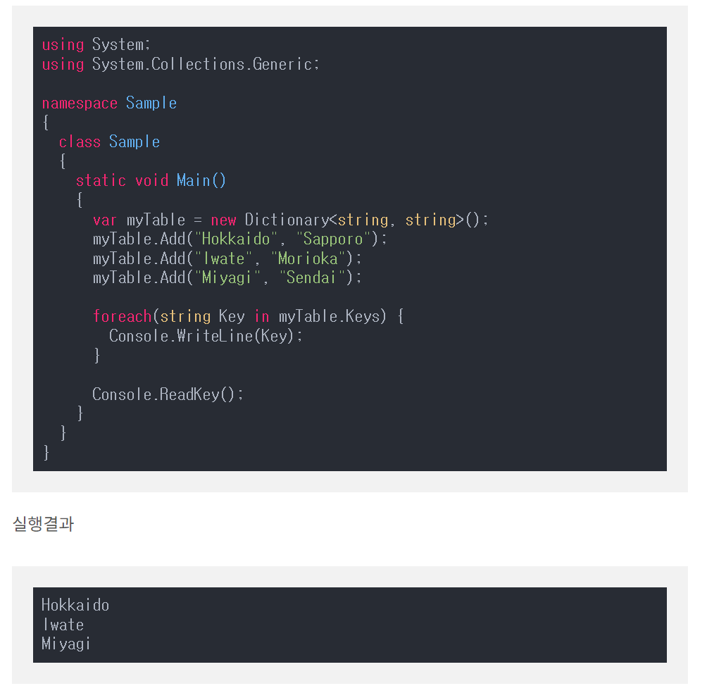
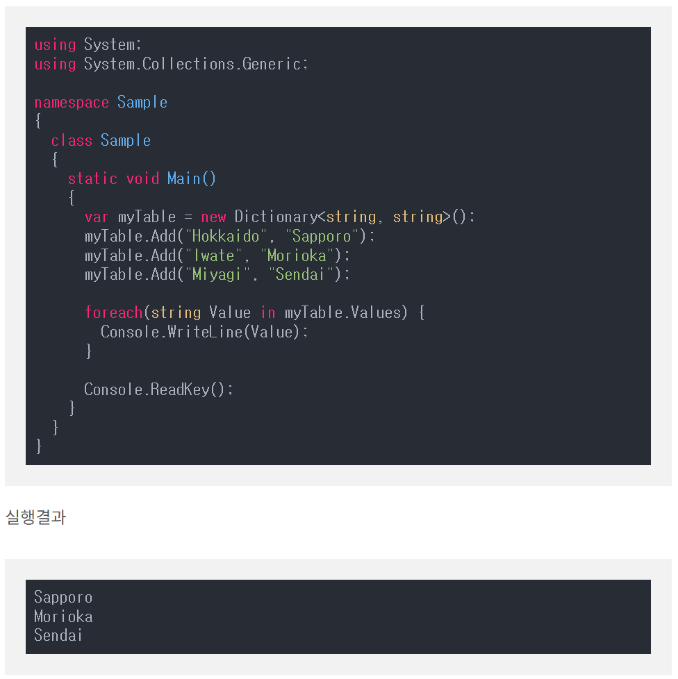

# Dictionary

Resurces in c#


---

## Dictionary란?

- Key라고 불리는 값과 Value라고 불리는 값이 있는 형식의 컬렉션이다. (연관 배열이라고 부른다)
- 비슷한 형식으로는 배열과 리스트가 있다.

---

### Dictionary 선언

→ ```Dictionary<Key 데이터형, Value 데이터형> 오브젝트명= new Dictionary<Key 데이터형, Value 데이터형>()```

**Dictionary 추가**

오브젝트명.Add(”추가하고 싶은 Key 값”, “추가하고 싶은 Value 값”);

**Dictionary 삭제**

오브젝트명.Remove(”삭제하고 싶은 key 값”); → key 값 삭제

오브젝트명.Clear(); → 모든 데이터 삭제

### 특정 값만 가져오기

---

**Key 값**



**Value 값**



### 요소 검색하기

---

**Key 검색하기**

오브젝트명.ContainsKey(”찾고 싶은 Key 값”);

**Value 검색하기**

오브젝트명.ContainsValue(”찾고 싶은 Value 값”);
```
오브젝트명.TryGetValue(”찾고 싶은 Key 값”, out “리턴 받고 싶은 var 값”);

‘TryGetValue → out 키워드 필수 사용’

‘TryGetValue → boolean 형으로 반환됨’
```

**기타..** Where문, Select문 등등