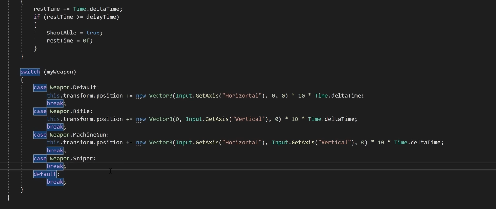
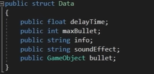
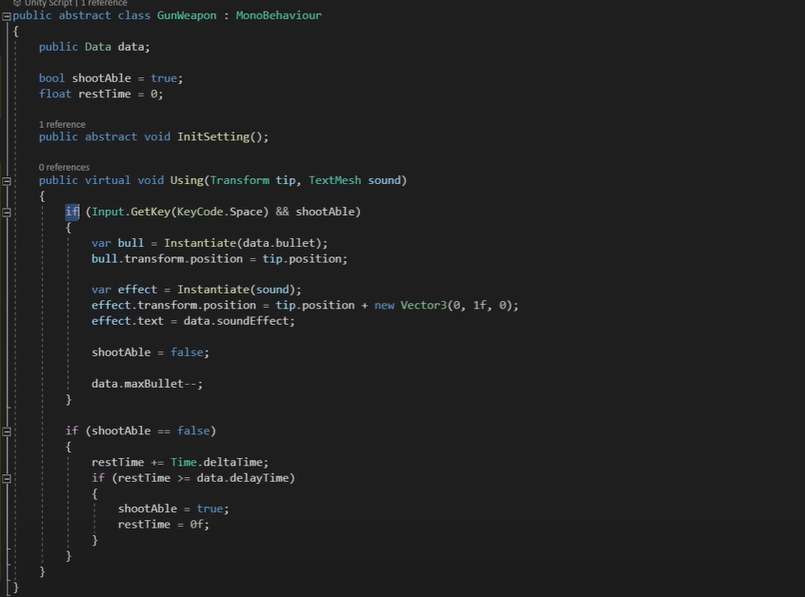
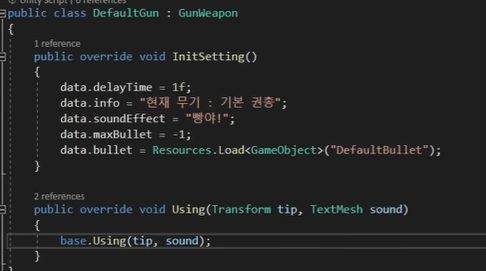

# 전략 패턴

## 전략 패턴이란?

전략을 쉽게 바꿀 수 있도록 해주는 디자인 패턴이다

### 전략 패턴을 사용하면 유지보수가 좋다는 장점이 있습니다

## 사용 예시

ex) switch문으로 새로운 것을 추가 해줄 때마다 case를 추가해주면서 유지보수가 좋지않은 코드

ex) 전략 패턴 사용 코드

- GunWeapon스크립트는 무기들의 부모로 함수들을 상속한다

- 오버라이드로 내용을 다르게한다