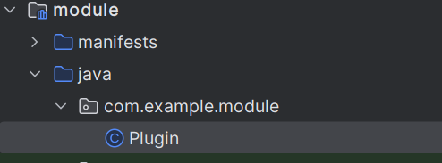

# 유니티에서 안드로이드 플러그인 사용법

유니티로 안드로이드 게임을 만들 때, 안드로이드OS에서 지원하는 여러가지 기능을 사용할 수 있다.

## 안드로이드 기능 호출의 구조

안드로이드 앱에서 화면의 UI를 표현하고, 여러가지 동작을 실행하는 주체인 **Activity** 클래스가 있다.

Activity는 안드로이드의 4대 컴포넌트 중 하나다.

Activity는 정의된 동작을 실행하거나, **Intent**를 통해 다른 컴포넌트와 상호작용 할 수 있다.

유니티에서는 유니티가 사용하는 Activity를 받아온뒤, 플러그인에 정의된 동작을 Activity에서 실행하는 구조이다.

## 플러그인을 생성하기 위한 설정

안드로이드 스튜디오에서 프로젝트를 생성해야 한다.


유니티의 Activity를 사용하기 때문에 Activity가 필요 없으니 No Activity 또는 Empty Activity를 선택한다.


프로젝트 이름을 설정하고, 언어를 자신이 쓸 언어(여기선 자바)로

Minimum SDK를 유니티의 기본 설정 버전인 API 19 (”KitKat”; Android 4.4)

그래들 설정을 위해 Groovy DSL (build.gradle)로 설정

유니티 버전 폴더\Editor\Data\PlaybackEngines\AndroidPlayer\Variations\il2cpp\Release\Classes

여기에 존재하는 class.jar 파일을 앱의 libs 폴더로 복사한다.

이제 유니티로 정보를 보내는 기능을 사용할 수 있다.

유니티의 class.jar를 가져와 유니티의 기능을 사용할 수 있게 되었지만, class.jar가 완성된 플러그인에 같이 들어가면 안되기 때문에 따로 설정해야 한다.


앱의 build.gradle의 dependencies 내에 아래 코드를 추가한다.

compileOnly fileTree(dir:'libs',include:['*.jar'])



자바 파일을 앱 내에 추가한다.

## 플러그인 스크립팅

설정을 끝내고 자바 파일을 만들었으면 유니티에서 사용할 기능들을 만들 수 있다.

클래스 내에 함수를 정의해두면 유니티에서 클래스를 받아와 함수를 실행할 수 있다.

이 때, 유니티에서 객체를 받아오기 위해 플러그인의 자바 클래스는 싱글턴으로 만드는게 좋다.


플러그인에서는 유니티의 함수를 실행하기 위해 UnityPlayer.UnitySendMassage 함수를 사용할 수 있다.

이 함수는 게임오브젝트 이름과 함수 이름을 통해 씬에 존재하는 게임오브젝트의 컴포넌트에서 함수를 실행할 수 있다.

유니티 스크립트에서 플러그인의 클래스와 인스턴스 정보를 받아오기 위해 아래의 코드를 작성한다.

```csharp
private AndroidJavaClass javaClass = null;
private AndroidJavaObject javaClassInstance = null;

void Awake()
{
    javaClass = new AndroidJavaClass("com.example.project.fileSelector");
    if (javaClass != null)
    {
        javaClassInstance = javaClass.CallStatic<AndroidJavaObject>("GetInstance");
    }
}
```

## 유니티에서 플러그인 사용하기

먼저 안드로이드 프로젝트를 빌드해야한다.


Setting의 Experimental 탭에 들어가서

Configure all Gradle tasks during Gradle Sync 설정을 켠다.


그후 Gradle 탭에서 assemble을 더블클릭하면 빌드가 완료된다. 

앱 폴더\build\outputs\arr 폴더에 가면 빌드완료된 arr 파일이 있다.

그 파일을 유니티 프로젝트의 Assets\Plugins\Android 폴더를 만들어서 옮기면 된다.

# 안드로이드 플러그인의 활용

유니티에서 안드로이드 플러그인을 통해 여러가지 기능을 구현할 수 있다.

## 메시지 띄우기

안드로이의 토스트 기능을 사용해 텍스트 메시지를 띄울 수 있다.

```csharp
//유니티 코드
private void ShowToast(string massage)
{
		javaClassInstance.Call("ShowToast", massage);
}
```

```java
//플러그인 코드
public void ShowToast(String massage){
    Toast.makeText(UnityPlayer.currentActivity, massage, Toast.LENGTH_LONG).show();
}
```


## 공유하기

메신저를 통해 다른사람에게 정보를 공유하는 기능을 구현할 수 있다.

```java
//플러그인 코드
public void Share(String title,String chooserTitle){
    Intent intent = new Intent().setType("text/plain")+
            .setAction(Intent.ACTION_SEND_MULTIPLE);
    intent.putExtra(Intent.EXTRA_TEXT,title);
    UnityPlayer.currentActivity.startActivity(Intent.createChooser(intent, chooserTitle));
}
```

## 파일 선택창

유저가 디바이스의 파일을 선택하고, 경로를 반환받을 수 있다.