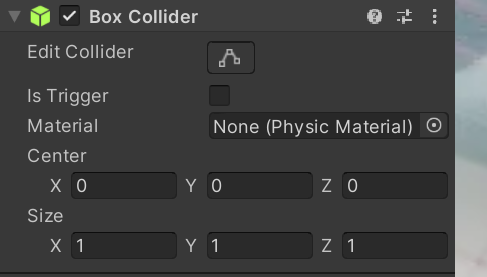

# 3D Collider

---

콜라이더란 충돌과 관련된 컴포넌트이다.  

콜라이더는 3D 오브젝트를 위한것과 2D 오브젝트를 위한 콜라이더로 나눠진다.

3D 오브젝트를 위한 콜라이더의 예시로는 MeshCollider, SphereCollider, BoxCollider 등이 있다.

# 3D Collider 예시

## Box Collider

사각형 모양의 콜라이더이다.

Edit 콜라이더를 누르면 콜라이더의 모양을 직접 마우스로 조정할수 있다.

| 이름 | 설명 |
| --- | --- |
| Is Trigger | 트리거 사용 여부 (물리적 충돌 관련) |
| Material | 콜라이더에 사용되는 물리적 재질 |
| Center | 콜라이더의 중심점 (로컬 기준) |
| Size | 콜라이더의 크기 (오브젝트의 Transform 기준) |

## Sphere Collider

구 모양의 콜라이더이다.

속성은 Box Collider와 같다.

## Capsule Collider

캡슐 모양의 콜라이더이다.

| 이름 | 설명 |
| --- | --- |
| Radius | 콜라이더의 반지름 (로컬 기준)  |
| Height | 캡슐의 높이 |
| Direction | 캡슐의 방향 (X, Y, Z 존재) |

## Mesh Collider

메쉬 모양의 콜라이더이다.

| 이름 | 설명 |
| --- | --- |
| Convex | 충돌 감지 여부 |
| Cooking Options |  |
| None | Cooking Option 비활성화 |
| EveryThing | Cooking Option 모두 활성화 |
| Cook for Faster Simulation | 런타임에 최적화된 Collider 생성  생성 시간이 오래 걸림 |
| Enable Mesh Cleaning | Mesh의 결함 제거                              Collision 충돌시에 유용 |
| Weld Colocated Vertices | 같은 위치에 있는 메쉬를 결합 |
| Use Fast Midphase | Midphase 알고리즘을 사용 |
| Mesh | 충돌에 사용할 메쉬 |

## Terrain Collider

| 이름 | 설명 |
| --- | --- |
| Terrain Data | Terrain Data |
| Eneble Tree Collider | 트리 콜라이더 여부 |

# Collider 충돌

Collider가 존재하는 게임 오브젝트가 서로 충돌할 경우

IsTrigger 여부에 따라 OnCollision 혹은 OnTrigger가 호출된다.

충돌 감지 조건

- 두 오브젝트 모두 Collider가 존재
- 충돌 하는 게임 오브젝트에 Rigidbody 존재

### OnCollisionXX2D 함수 - 물리적 충돌 O (매개변수 collision2D)

IsTrigger = false

- **OnCollisionEnter2D** - 충돌 시 호출
- **OnCollisionStay2D** - 충돌 중 호출
- **OnCollisionExit2D** - 충돌이 끝날 때 호출

### OnTriggerXX2D 함수 - 물리적 충돌 X (매개변수 colliider2D)

IsTrigger = true

- **OnTriggerEnter2D** - 트리거 충돌 시 호출
- **OnTriggerStay2D** - 트리거 충돌 중 호출
- **OnTriggerExit2D** - 트리거 충돌이 끝날 때 호출