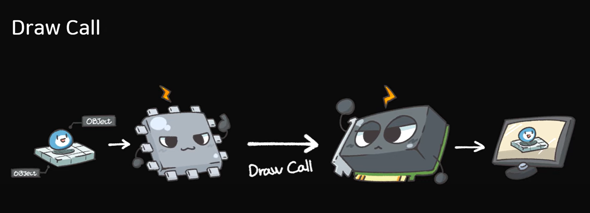

# Batching이란?

## Draw Call

- 컴퓨터에 CPU, GPU가 있는데 CPU는 데이터를 읽는 역할을 하고 GPU가
    
    이 데이터를 읽고 해석해서 컨텐츠를 그리는 역할을 하는데 이 작업을
    
    Draw Call이라한다
    

## SetPass Call

- Draw Call을 할때 커맨드 버퍼라이트라는 데이터들이 따라오는데 이중에서 Material이나
    
    Shader를 묶어놓은 것들이 SetPass이고 이걸 전달하는것이 SetPass Call이다
    

## Batch

- 위에서 DrawCall, SetPassCall과 그래픽을 구성하고 있는 데이터들도 포장해서 GPU한테
    
    넘기는 것을 Batch라 하는데 Batch수가 많으면 부하가 많이 걸리는데 이걸 줄이는것을 
    
    최적화라고 부른다

# 최적화 예시

## 1. 동적 Batcing

*일반적인 Material

최적화를 하지않은 일반적인 상황일때 Batch의 수와 SetPass Call수가 같은 최적화가 전혀 되지않는다 

*Material을 합친 상태

Material을 합쳐 최적화를 시켰을때 SetPass Call이 3배 정도 줄어들어 최적화가 되는 모습이다

위와 같은 방법으로 2D에서 Sprite도 최적화 할 수 있습니다

---

## 2. 정적 Batcing

이 방법은 오브젝트가 static이 되기 때문에 Transform이 움직이지 않는 단점이 있다