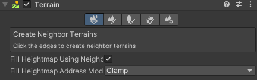
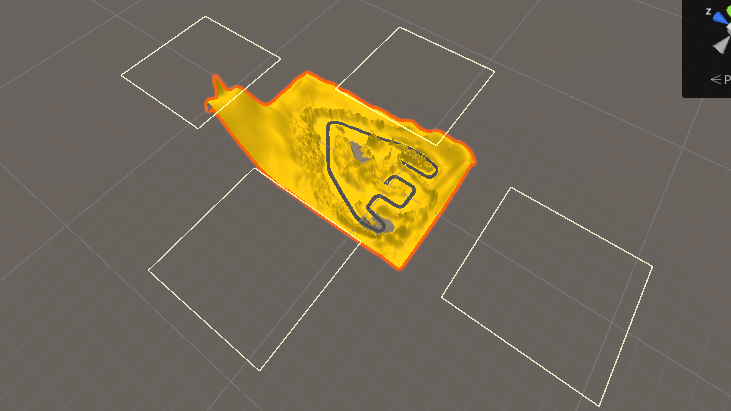

# Terrain
---

**Terrain**은 지역이라는 뜻의 이름과 맞게 게임에 **랜드스케이프**를 만들고

**나무**나 **풀**을 추가 할 수 있는 기능입니다.

# Create Neighbor Terrains

Terrain 생성시 주위에 영역을 표시하며, 새로 연결할 Terrain을 설치할 수 있습니다.

**Fill Heighmap Using Neighbors :** 체크박스를 하게되면 새로 생성되는 Terrain의 모서리 높이를 인접타일과 맞춰준다.

**Fill Heighmap Address Mode :** 드롭다운으로 프로퍼티를 선택해서 블렌딩 방법 설정

| 프로퍼티 | 설명 |
| --- | --- |
| Clamp | 인접 Terrain 타일의 모서리 높이들 간의 크로스 블렌딩 수행 |
| Mirror | 인접 Terrain 타일을 미러링한 후 크로스 블렌딩 수행 |

# Terrain Tool

- **Raise or Lower Terrain :** Terrain의 높이를 설정한다( Shift키로 올릴지 낮출지 설정 )
- **Paint Holes :** Terrain에 구멍을 낸다
- **Paint Texture :** Terrain 표면에 텍스쳐를 적용한다
- **Set Height :** Terrain의 높이를 특정 값으로 설정한다
- **Smooth Height :** Terrain의 높이를 매끄럽게 만든다
- **Stamp Terrain :** Terrain위에 브러시 모양을 스탬핑한다

# Layer & Brushes

- **Create Layer :** Texture2D 기반으로 Layer 생성
- **Add Layer** : Terrain에 레이어 할당
- **Replace Layer** : 레이어 교체
- **Remove Layer** : 레이어 삭제

- **Default Brush** : 단순한 원을 포함하여 간단하게 스케치 할수 있는 브러시
- **Custom Brush** : Texture2D 기반으로 새로운 모양의 브러시를 만들어 쓸 수 있다.

| 이름 | 설명 |
| --- | --- |
| Brush Size | Brush가 Terrain에 미치는 범위를 설정 할 수 있다. |
| Opacity | 이름이 불투명도라 값이 올라가는만큼 진하게 된다 |

# Paint Trees , Details

Tree 혹은 Detail을 설치할 수 있고 그에 맞는 설정들을 할 수 있다.

# Terrain Settings

