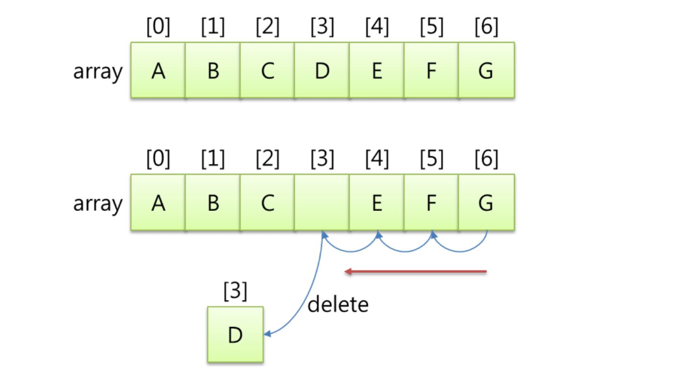
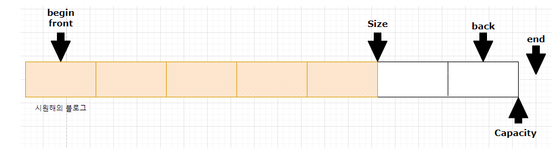

# Vector

**vector** c++

---

## 배열의 문제점

### 1. 자료의 삽입과 삭제에 비효율적이다.

3번 인덱스를 지운다고 하면 456번 인덱스에 있는 애들을 앞으로 한 칸씩 당겨야 한다.

또한 배열의 가운데 삽입하고 싶다면 한 칸씩 밀어야 한다.



### 2. 크기를 한 번 정하면 바꿀 수 없다.

```cpp
int a[100];
char word[200];
```

해당 배열에 몇 개의 데이터가 들어갈 지 모르니, 일정 크기의 배열을 선언해두고 각각의

인덱스마다 값을 사용하여 무언가의 조작을 해야 한다.

문제는 선언한 크기보다 더 큰 수의 데이터들을 가져와야 할 때, 

새롭게 배열을 정의해야 한다.

---

## Vector의 선언과 사용

위의 불편함 들을 어느 정도 보완한 자료구조가 **Vector**이다.

단순하게 선언만 해두고 (크기 직접 선언 가능) push_back이라는 함수를 활용하여

값을 추가하는 방식으로 동적으로 사이즈 조정을 할 수 있다.

아래와 같은 방식으로 사용할 수 있다.

```cpp
#include <iostream>
#include <vector>

using namespace std;

int main() {
	vector<vector<vector<int>>> v;
	
	for(int i = 0; i < n; i++) {
		v.push_back(i);
	}
	
	return 0;
}
```

---

## vector의 구조

1. begin : 첫 번째 위치
2. front : 첫 번째 원소
3. back : 마지막 원소
4. end : 마지막 위치 + 1
5. size : 원소들의 개수 
6. capacity : 원소들을 담을 수 있는 메모리가 할당되어 있는 공간의 크기



---

## Vector의 멤버 함수

| 멤버 함수 | Descrption |
| --- | --- |
| v[index] | v의 index 번째의 원소를 반환 |
| empty() | vector가 비어있는지 체크,
비어있을 경우 True,
데이터가 있을 경우 False |
| reserve(n) | 미리 capacity를 결정하는 함수,
vector를 n의 크키로 변경 |
| clear() | vector 내의 모든 데이터 삭제 |
| erase(start, end) | start부터 end까지 위치의 원소 제거 |
| insert(index, data) | vector의 원하는 index에 data 추가 |