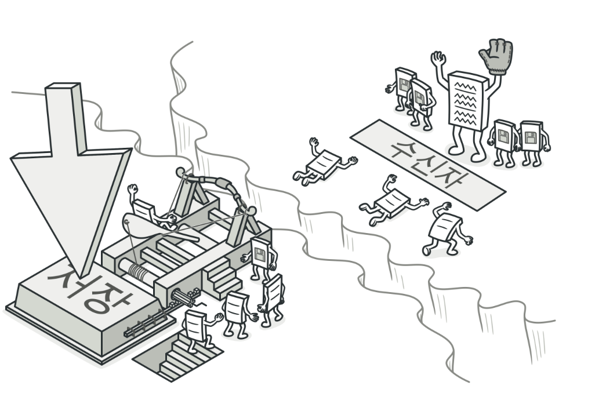
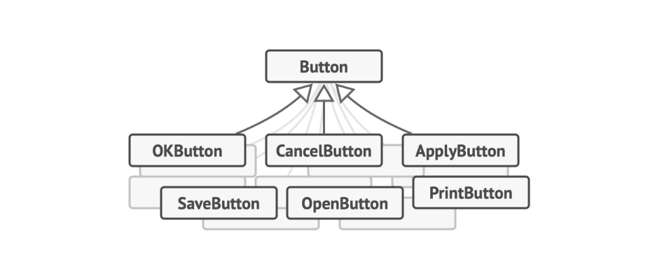

# 커맨드 패턴
## 커맨드 패턴이란?

**커맨드**는 요청을 요청에 대한 모든 정보가 포함된 독립실행형 객체로 변환하는 행동 디자인 패턴입니다. 이 변환은 다양한 요청들이 있는 메서드들을 인수화 할 수 있도록 하며, 요청의 실행을 지연 또는 대기열에 넣을 수 있도록 하고, 또 실행 취소할 수 있는 작업을 지원할 수 있도록 합니다.




## 커맨드 패턴을 사용하는 이유

여러 버튼 자식클래스를  가지고 Click()으로 기능을 각각 실행 시키고 싶은 기능을 실행한다 하면

자식 클래스를 많이 가질수록 *분기가 많아지고 *OCP(개방 폐쇠 원칙)에서도 위반된다.
---

분기 : 분기란 if문 같은 조건문으로 선택적으로 코드를 실행 시키는 것이다

OCP : 코드를 수정 할 때 다른 스크립트들도 다 수정 해주는 귀찮은 상황을 만들지 않는 것

## 코드 예시

```csharp
using System;

namespace RefactoringGuru.DesignPatterns.Command.Conceptual
{
    public interface ICommand
    {
        void Execute();
    }

    class SeongChan : ICommand
    {
        private string _payload = string.Empty;

        public SeongChan(string payload)
        {
            this._payload = payload;
        }

        public void Execute()
        {
            Console.WriteLine($"성찬 : 걍 끝내고 {this._payload} 가자아아아");
        }
    }

    
    class Minheok : ICommand
    {
        private Jinwoo _jin;

       
        private string _a;

        private string _b;

       
        public Minheok(Jinwoo receiver, string a, string b)
        {
            this._jin = receiver;
            this._a = a;
            this._b = b;
        }

        
        public void Execute()
        {
            Console.WriteLine("민혁 : 잠만잠만, 진우가 P같이 오류 확인한데");
            this._jin.DoSomething(this._a);
            this._jin.DoSomethingElse(this._b);
        }
    }

    
    class Jinwoo
    {
        public void DoSomething(string a)
        {
            Console.WriteLine($"진우 : {a}");
        }

        public void DoSomethingElse(string b)
        {
            Console.WriteLine($"진우 : {b}");
        }
    }

    
    class Hyechan
    {
        private ICommand _onStart;

        private ICommand _onFinish;

        
        public void SetOnStart(ICommand command)
        {
            this._onStart = command;
        }

        public void SetOnFinish(ICommand command)
        {
            this._onFinish = command;
        }

        
        public void DoSomethingImportant()
        {
            Console.WriteLine("혜찬 : 우리 프로젝트 마무리 할건데 더 할거 없지?");
            if (this._onStart is ICommand)
            {
                this._onStart.Execute();
            }

            Console.WriteLine("혜찬 : 그럼 프로젝트 마무리할게");

            Console.WriteLine("혜찬 : 지금 머지한다");
            if (this._onFinish is ICommand)
            {
                this._onFinish.Execute();
            }
        }
    }

    class Program
    {
        static void Main(string[] args)
        {
           
            Hyechan hye = new Hyechan();
            hye.SetOnStart(new SeongChan("풍년"));
            Jinwoo jin = new Jinwoo();
            hye.SetOnFinish(new Minheok(jin,"아니 그 정돈 할 수 있잖아", "이야 오류가 없네요"));

            hye.DoSomethingImportant();
        }
    }
}
```