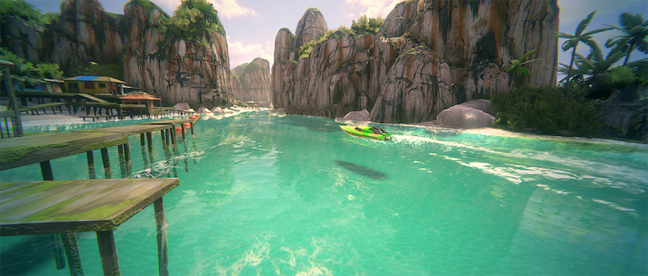
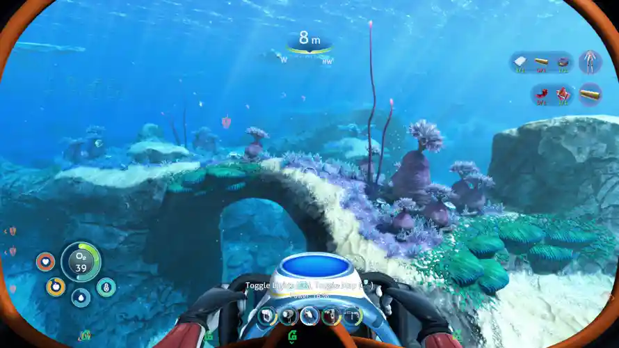
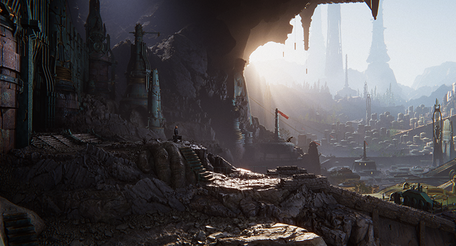

# **렌더링 파이프라인이란?**

## ***역할***
>**씬**의 콘텐츠를 가져와서 화면에 표시하는 **일련의 작업**을 수행한다.
+ 서로 다른 셰이더 출력, 기능을 보유하고 있기때문에 **파이프라인의 전환**에 어려움이 있다. 

### **일련의 작업 이란?**
 + **오클루전 컬링**
    + 다른 오브젝트에 의해 **완전히 가려진** 게임오브젝트에 대한 **렌더링 계산**을 못하도록하는 프로세스 
 + **렌더링**
    + 컴퓨터 프로그램을 통해 **가상의 3차원** 공간에 위치한 **물체**를 모니터 화면으로 **그려내는** 작업
 + **포스트 프로세싱**
    + **물리적 카메라** 및 **필름 프로퍼티**를 시뮬레이션하거나 세련된 **시각 효과를 구현**

> ## **스크립터블 렌더 파이프라인** 
## ***유니버셜 렌더 파이프라인(URP)***
**유니버셜 렌더 파이프라인**(**URP**)는 최적화된 그래픽을 쉽고 빠르게 구현하도록 도와줍니다.

+ **서브노티카** 

## ***고해상도 렌더 파이프라인(HDRP)***
**고해상도 렌더 파이프라인**(**HDRP**)는 고해상도 그래픽을 구현할 수 있게한다.

## **장점**
>HDRD : 고성능발휘에 적합하다
+ VR처럼 현실감이 느껴지는 게임에 넣었을때 특히 좋을듯!

>URP : 범용성과 유연성이 좋다.
+ 여러 방면에서 유용하게 사용 할 수 있을 것 같다.