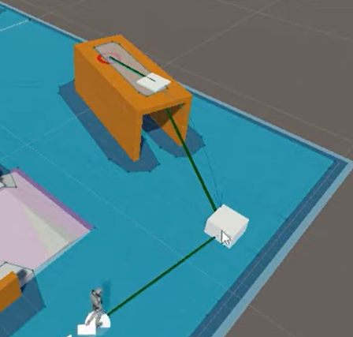

# NavMesh

NavMesh는 경로를 찾는 길찾기 AI이다

Window → AI → Navigation(Obsolete)를 가면 현재 씬에서 걸을 수 있는 오브젝트를 정해서 Bake하면 갈 수 있는 범위가 파란색으로 표시가 된다

관련 컴포넌트

- NavMeshAgent

 

NavMeshAgent 컴포넌트를 가진 오브젝트는 목적지를 전해줘서 움직일 수 있고 속도나 장애물을 피하는 능력을 프로퍼티에서 조절 할 수 있다

- NavMeshObstacle

NavMeshObstacle이 있는 오브젝트는 장애물이 되는데 따로 Bake를 다시 하지 않아도 장애물이 있는 경로를 피해 간다

- NavMeshLink

큐브와 큐브사이에 경로를 만들어서 위로 올라가게 할 수 있다

- NavMeshSurface

Bake하려는 범위와 위치를 조절 할 수 있고 다른 NavMesh와 다르게 동적으로 Bake를 해줄 수 있다