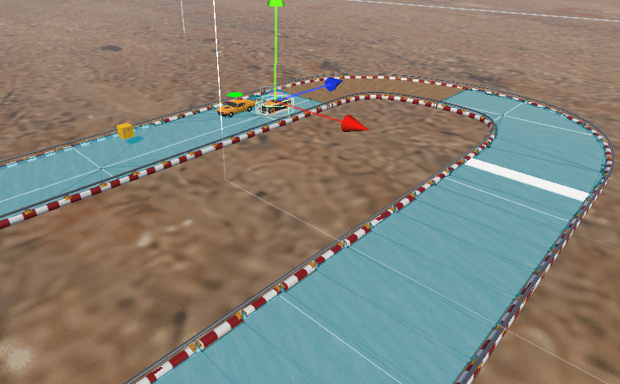

# 오브젝트 풀링

### 오브젝트 풀링이란?

오브젝트 풀에 오브젝트들을 미리 생성해놓은 뒤에 오브젝트를 사용할 때 마다 빌려오고 이용이 끝나면 다시 오브젝트 풀에 돌려준다

### 오브젝트 풀링의 장점

1. 일반적으로 Instantiate로 오브젝트를 생성하고 Destroy로 삭제를 하는데 프레임 드랍이 되어서 이것을 막는다.
2. 오브젝트 풀링을 쓰지 않을 경우에 공간 낭비가 있을 수 있기 때문에 오브젝트 풀링으로 막을 수 있다.

### **오브젝트 풀링 사용 예시**

*먼저 사용하기 전에 오브젝트들은 전부 비동기화를 해서 풀에 넣고 사용할 때 마다 오브젝트들을 동기화 해서 사용한다