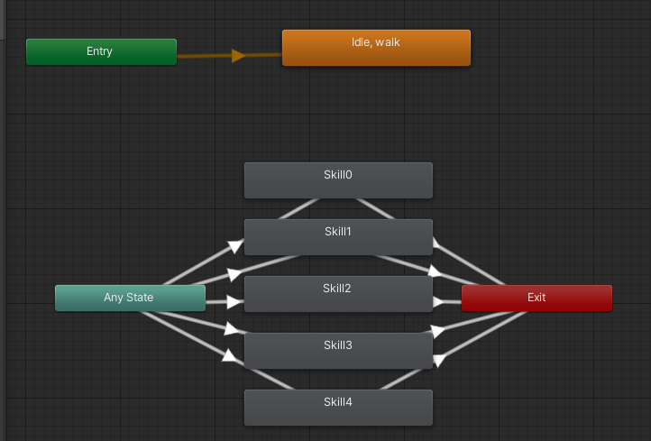
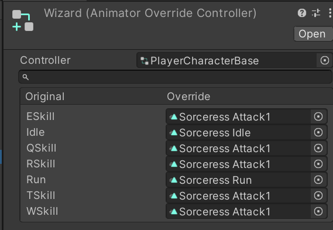

# 애니메이터 오버라이드 컨트롤러

## 역할

AnimatorOverrideController는 로직이 구현되어있는 AnimatorController를 참조해 사용되는 애니메이션을 다른 애니메이션에 대응시켜 동일한 로직의 여러가지 AnimatorController를 빠르게 만들수있다.

## 특징

- RuntimeAnimatorController를 상속하기때문에 Animator의 Controller로서 참조될 수 있다.
- 비어있는 애니메이션 클립은 자신이 참조한 AnimatorController의 클립으로 자동설정된다.
- 실제 오버라이딩과 다르게 확장이 불가능하다.

## 사용예시

동일한 로직을 쓰는 게임캐릭터를 여러개 구현할때, 애니메이션만 바꿔서 빠르게 만들수있다.

하지만 확장이 불가능하기때문에 한계가있다.

- AOS,RPG장르등의 플레이어 캐릭터는 홀드스킬이나 패링스킬등, 로직이 필요한 애니메이션으로 인해 활용이 불가능하다.

