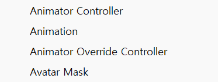
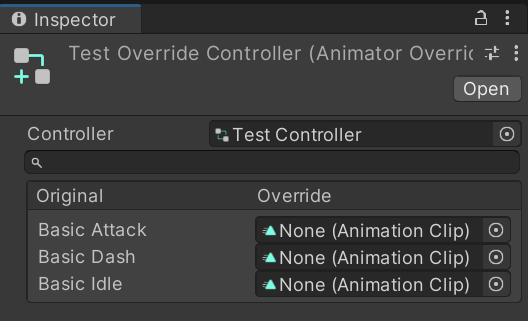

# Animator Override Controller

애니메이터 오버라이드 컨트롤러는 하나의 애니메이터를 기반으로 애니메이터의 원본 구조와 파라미터, 로직은 유지한 채 내부의 애니메이션 클립만 다르게 사용할 때 사용할 수 있는 기능이다.

스컬을 예시로 들자면 해골을 교체할 때 외형은 바뀌지만 걷기, 대쉬, 점프 등의 기능들은 그대로 유지될 때 애니메이터 오버라이드 컨트롤러를 사용하여 기능을 구현할 수 있다.

## 구현 방법

Project ⇒ Create ⇒ Animator Override Controller 로 생성

생성한 애니메이터 오버라이드 컨트롤러의 베이스가 될 애니메이터 컨트롤러를 Controller에 선택

이후 교체할 애니메이션 클립을 오버라이드 밑에 애니메이션 칸에 넣어준다.
