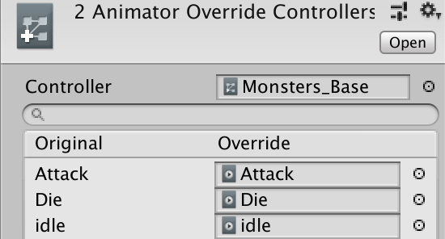

# 애니메이터 오버라이드 컨트롤러
  
(Monsters_Base로 생성한 애니메이션 오버라이드 컨트롤러. 아래에는 애니메이션 이름과 클립의 리스트가 있다.) 
애니메이션 컨트롤러를 인스턴스화 시켜서 기존 로직에 다른 애니메이션 클립을 적용시킬 수 있는 기능이다.  
## 활용
---------
보통 로직은 같지만, 애니메이션이 달라질 때 사용한다.  
RPG게임의 몬스터로 예를 들자면, 패턴은 같지만 다른 애니메이션을 가진 몬스터가 등장한다.  
그때 애니메이션 오버라이드 컨트롤러를 사용하면 간단하게 몬스터의 다양한 애니메이션을 
구현할 수 있다.