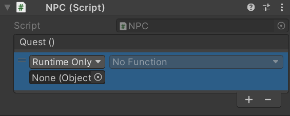

# **Unity Action** & **Unity Event**

## Unity Event

>**C#의 이벤트**와 **Deligate(대리자)** 를 유니티가 사용하기 편하도록 **랩핑(재포장)** 해놓은 것입니다.

+ **Deligate** 등록되어 있는 함수들을 연쇄적으로 실행시켜준다

***장점***
+ **커플링**을 줄여준다
+ 각각 다른 스크립트에서 함수를 가져와 사용할때 스크립트들을 참조 하지 않아도 된다
+ 함수끼리 몰라도 실행이 되기때문에 스파게티 코드가 되지 않는다

+ **커플링** 오브젝트 사이의 연결정도

***사용예시***
+ using UnityEngine.Events; (**필수**)

```csharp
using System.Collections;
using System.Collections.Generic;
using UnityEngine;
using UnityEngine.Events;

public class NPC : MonoBehaviour
{
    public UnityEvent Quest;

    private void QuestMessage()
    {
        Quest.Invoke();
    }
}
```


##  Unity Action

> 리턴 타입과 매개변수가 없는 함수의 등록을 위한 Deligate(대리자)

***Action과 Event의 차이점***

>유니티이벤트가 메모리 할당량이 낮다. 하지만 속도가 상대적으로 느리다.

***사용예시***
```csharp
using System.Collections;
using System.Collections.Generic;
using UnityEngine;
using System; //필수

public class Worker : MonoBehaviour
{
    Action work; //액션

    void MoveBricks()
    {
        Debug.Log("벽돌을 옮겼다.");
    }

    void DigIn()
    {
        Debug.Log("땅을 팠다.");
    }

    void Start()
    {
        //액션에 함수 등록
        work += MoveBricks;
        work += DigIn;
    }

    void Update()
    {
        if (Input.GetKeyDown(KeyCode.Space))
        {
            //액션에 등록되어있는 함수 연쇄실행
            work();
        }
    }
}
```