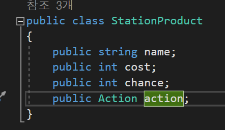
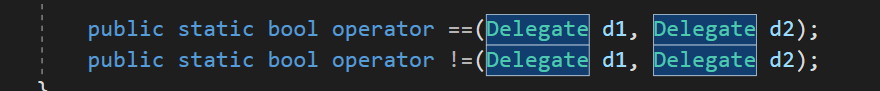

# 람다식

## 개념정리

- 대리자 : 메서드를 참조하는 형식
- 람다식 : 함수를 식으로 나타낸것
- 익명함수 : 이름이 없는 함수

## 대리자

대리자는 System.Delegate 클래스로 정의되어있으며

참조할 메서드의 형태를 delegate키워드를 통해 선언하여 사용한다.

대리자에서 참조할 메서드의 형태를 제한하는 요소는 다음과같다.

- 매개변수의 개수
- 매개변수의 타입과 순서
- 반환형

대리자의 기본형태는 다음과같다.

```csharp
//delegate 반환형 대리자형식이름(매개변수들);

delegate void Function(int a);
delegate int Add(int a, int b);
```

이렇게 delegate를 통해 참조할 형태를 선언해주면

Function타입과 Add타입의 대리자형식 클래스가 선언된다.

대리자형식 클래스를 선언했으면 이 형식을 통해 메서드를 참조하고 실행할수있다.

```csharp
delegate int Calculate(int a, int b);

int Add(int a, int b)
{
		return a + b;
}

int Minus(int a, int b)
{
		return a - b;
}

//Calculate 형식의 인스턴스 button1을 생성한후 Add 메서드릂 참조한다.
Calculate button = Add;

//button이 참조하는 메서드를 실행한다.
Debug.Log(button(2,4));
//반환 : 6

button = Minus;
Debug.Log(button(13,6));
//반환 : 7
```

메서드를 참조할때 += 연산자와 -=연산자를 사용할수있다.

- += : 특정 메서드를 추가로 참조한다. (여러 메서드를 동시에 참조가능)
- -= : 특정 메서드를 참조하고있을경우 그 메서드의 참조를 종료한다. (여러번 참조할경우 하나만종료)

```csharp
delegate int Calculate(int a, int b);

int Add(int a, int b)
{
		return a + b;
}

int Minus(int a, int b)
{
		return a - b;
}

Calculate button = Add();

```

### 여러 메서드를 참조하는 대리자 인스턴스의 반환

+= 연산자를 통해 여러 메서드를 참조하는 대리자 인스턴스는 가장 마지막에 참조한 메서드의 반환값을 반환한다.

```csharp
Func<int> f = null;
f += () => { Debug.Log(1); return 1; };
f += () => { Debug.Log(2); return 2; };
Debug.Log(f());

//실행시 1,2,2 순으로 출력된다.
```

## 람다식

람다식은 익명함수를 식으로 표현하는 문법이다.

익명함수는 이름없이 변수에 저장되는형태로 사용되는 함수로, 람다식을통해 만들수있다.

```csharp
//(매개변수들) => 명령문;
//(매개변수들) => { 명령문들 };     중괄호를 쓸 경우에는 명령문을 여러줄 쓸수있다.

(int a, int b) => a+b;    //두 수를 더해주는 함수, 중괄호없이 쓸경우 return은 생략가능하다.

//1부터 a까지 더해주는 함수
(int a) = > {
		sum = 0;
		for(int i = 1; i <= a; i++)
		{
				sum += i;
		{
		return sum;
}
```

이렇게 만든 익명함수는 형태가 알맞을경우 대리자형식에 참조당할수있다.

```csharp
delegate int Calculate(int a, int b);

Calculate add = (int a, int b) => a + b;
Calculate mul = (a, b) => a * b;  //대리자에 매개변수형식이 미리 선언되어있어 생략이 가능하다.
```

## Func와 Action

C#에서는 메서드를 참조할때마다 delegate를 선언해줘야하는 귀찮은 상황을 방지하기위해 Func와 Action이라는 두가지 편의성 클래스를 지원한다.

이 두클래스는 공통적으로 제네릭을통해 타입을 받고,

그 타입으로 이루어진 대리자형식처럼 사용할수있다.

- Action : 반환이 없는 대리자형식을 구현할때 쓰이며, 제네릭으로 매개변수타입들을 받는다.
- Func : 반환이 있는 대리자형식을 구현할때 쓰이며, Action과 같지만 마지막으로 받은 타입을    반환형으로 쓴다.

```csharp
Action count = () => Debug.Log("1234!");
Action<string> log = (message) => Debug.Log(message);

Func<float> oneFrame = Time.deltaTime;   //매개변수없이 float 형식을 반환
Func<float,int> floor = (a) => a >= 0 ? (int)a : -(int)a;   //float 형식을 받고 int를 반환
```

## 사용예시



상점에서 아이템 구매시 실행될 기능을 저장하는데 람다식을 사용했다.

## 잡다한 정보

- 대리자형식은 클래스이고, 람다식도 객체이다.
- 람다식에서는 쓰지않을 매개변수자리에 _ 를 넣어 무시항목으로 지정할수있다.

```csharp
Action<int> log = (_) => Debug.Log(Time.deltaTime);
//매개변수와 상관없이 Time.deltaTime을 출력한다.
```

- 대리자 인스턴스에 +=연산자나 -= 연산자를 사용할때, 대리자 인스턴스를 더하거나 빼줄 수 있다.
- 대리자 인스턴스의 Method 프로퍼티를통해 인스턴스가 마지막으로 참조한 메서드의 정보를 받아올수있다.

## 더 찾아봐야하는것



이것의 존재이유

대리자 인스턴스의 Target 프로퍼티 의미