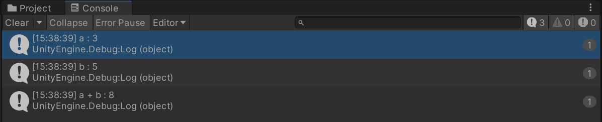
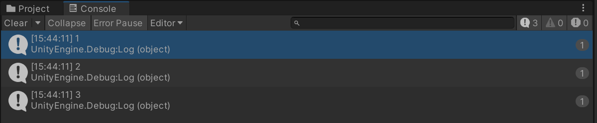

# C# Lambda

람다식이란 접근자, 함수 이름, return문이 없는 무명 함수를 말한다.

람다연산자(=>)를 사용하며 코드를 더 짧고 가독성 있게 작성할 수 있다.

## 람다식 구현 방법

`식 람다 : (매개변수) => 식`

`문 람다 : (매개변수) => { 식 }`

### 람다식 구현 예시

```csharp
public class LambdaTest : MonoBehaviour
{
    delegate void TestDel();
    TestDel testDel;

    private void Awake()
    {
        testDel += () => Debug.Log("test");
        testDel += () => { Debug.Log("test"); };
        testDel += () => { Debug.Log("test"); Debug.Log("test2"); };
    }
}
```

# 람다식 사용 예시

사용예시로는 버튼의 이벤트 핸들러를 등록할 때 메서드를 등록하는 대신 람다식을 사용하여 이벤트 핸들러를 등록하는 기능을 구현하였다.

```csharp
using UnityEngine;
using UnityEngine.UI;

public class LambdaEx1 : MonoBehaviour
{
    public Button btn;
    public int a, b;

    void Awake()
    {
        btn.onClick.AddListener(() =>
        {
            Debug.Log("a : " + a);
            Debug.Log("b : " + b);
            Debug.Log("a + b : " + (a + b));
        });
    }
}
```



또다른 예시로 리스트를 특정 조건으로 필터링하는 기능을 람다식을 사용하여 구현하였다.

```csharp
using System.Collections.Generic;
using UnityEngine;

public class LambdaEx2 : MonoBehaviour
{
    List<int> numbers = new List<int>() { 1, 2, 3, 4, 5 };

    private void Awake()
    {
        List<int> filteredNumbers = numbers.FindAll(x => x <= 3);

        foreach(var number in filteredNumbers)
        {
            Debug.Log(number);
        }
    }
}
```



## 람다식을 공부하면서

- 람다식이 사용되는 예시가 너무 많고 다양해서 좌절했다.
- 많이 유용할 것 같아 프로젝트를 하면서 많이 써봐야겠다.
- 람다식 사용 예시로 delegate에 람다식을 추가하고 실행하는 방법도 생각했었는데 공부하다보니까 굳이 그렇게 사용할 이유가 없는 것 같다.