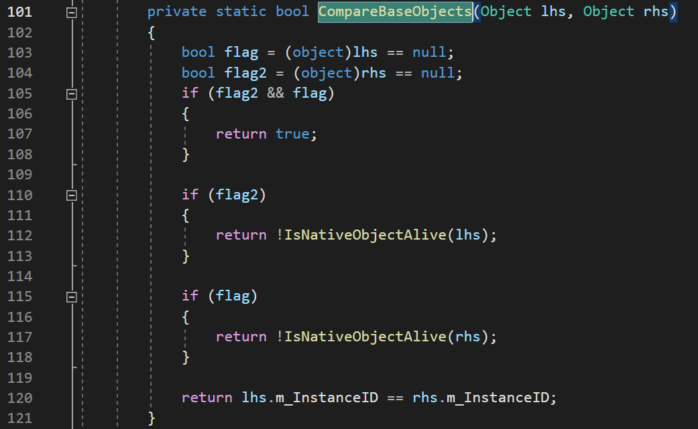
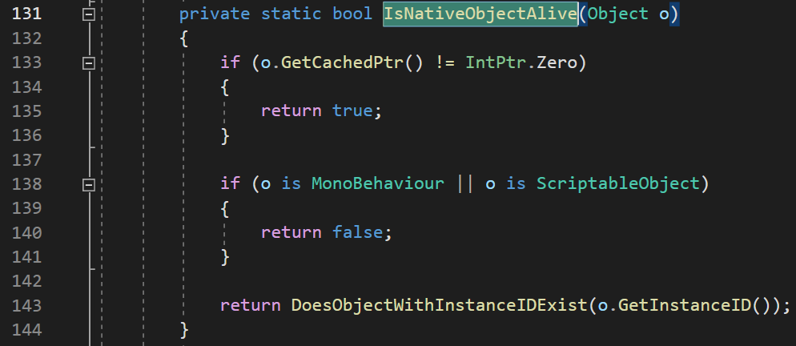
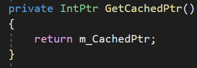
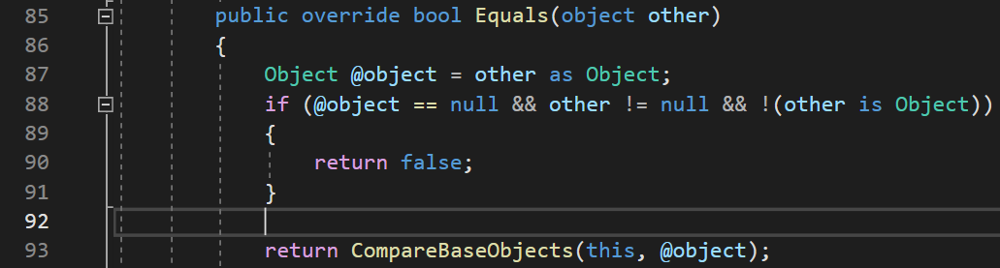
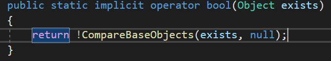

# C#의 null 체크 방법들

C#에서는 참조가 null인지 확인하기 위한 여러가지 방법들을 제공한다.

## C#의 비교 방법들

### == 사용

가장 보편적으로 사용되고 간단한 비교방법이다.

필드의 정보들을 비교해 반환한다. (객체의 정보가 같은지 확인한다.)

### Equals() 사용

기본적으로 ==과 같은역할을한다.

하지만 virtual 키워드가 존재해 오버라이딩이 가능하다.

### ReferenceEquals() 사용

두 변수의 참조를 비교한다. (같은 객체인지 확인한다.)

virtual 키워드가없어 오버라이딩이 불가능하다.

## C#의 null 확인

c#에서는 null을 편하게 확인하고 활용하는 문법을 제공한다.

### ?. 과 ?[].

?. 과 ?[]. 은 null 조건 연산자라고 불린다.

특정 변수의 메서드에 접근할때 변수의 값이 null이면 접근을막아 NullReferenceExceptionError가 발생하지않게하는 문법이다.

```csharp
GetComponent<Health>()?.TakeDamage(100);  //Health가 존재한다면 데미지를 입힌다.

public List<Health> target;
for(int i = 0; i < target.Count;i++)
{
		target?[i].TakeDamage(30);
}
//target들중 null이 아닌 대상에게 데미지를 입힌다.
```

### ??=

??=은  null 병합 연산자라고 불린다.

할당할 변수의 값이 null일때만 할당을 한다.

```csharp
GameObject target;
Collider[] cols = Physics.OverlapSphere(transform.position, 10);
foreach(Collider c in cols)
{
		target ??= c?.transform;
}

//null이 아닌 값 하나만 할당된다.
```

### ??

??는 반환하고자하는값이 null일경우 다른값으로 대체하여 반환하는 문법이다.

```csharp
public Transform spawnPos;
public GameObject prefab;

Instantiate(prefab,(spawnPos ?? transform));
//spawnPos에 prefab을 소환한다.
//spawnPos가 null이라면 transform에 소환한다.
```

### is null 사용

객체가 null인지 검사한다.

ReferenceEquals를 통한 비교와 같다.

```csharp
Action act = null;

print(act is null);  //true
```

# 유니티의 null 체크

유니티에서는 변수의 참조가 null값인지 확인해야하는 경우가 자주있다.

이런 상황에서 사용할수있는 여러가지 확인방법이 있다.

## Unity.Object와 C++네이티브 객체

유니티에서 우리가 사용하는 Unity.Object는 C++로 구현된 네이티브 객체를 래핑하는 객체이다.


유니티의 Object 객체는 자신의 C++ 네이티브객체의 포인터를 m_CachedPtr 변수를 통해 저장하고있다.

만약 Object.Destroy()를 호출해서 객체를 파괴한다면 m_CachedPtr이 참조하는 네이티브 객체가 파괴된다.

이때 본체인 네이티브 객체는 파괴되었지만, 개발자가 접근하는 C# 객체는 GC가 회수하기 전까지는 null이 아니기 때문에 생기는 문제를 막기위해 유니티는 fake null이라는 개념을 만들었다.

## fake null

fake null 현상은 C++ 네이티브 객체가 존재하지않는 C# 래핑객체를 null로 표시하는 방식이다.

Unity.Object의 코드를 살펴보면,


비교연산자가 이렇게 오버로딩되어있는것을 볼수있다.

CompareBaseObjects에 매개변수로 비교대상들을 넘기는데, 함수의 코드를 찾아보면,



103번줄과 104번줄에서 Unity.Object타입을 object타입으로 변환해,

오버로딩하지않은 비교연산자를 호출해 C# 객체가 존재하는지 여부를 flag와 flag2에 넣는다.

---

105번줄에서 C#객체가 둘다 null일경우 같은 값임으로 true를 반환한다.

---

110번줄부터 118번줄까지는 만약 두 C#객체중 하나만 null일경우,

null이 아닌 C#객체의 C++ 네이티브 객체가 존재한다면 false를, 존재하지않는다면 true를 반환한다.

C++ 네이티브 객체가 존재하지 않는다면 C# 객체도 null과 다름없음으로 null과 null을 같다고 판단해야하기 때문이다.

 

---

112번줄과 117번줄에서 네이티브객체의 존재여부를 확인하는함수인 IsNativeObjectAlive가 어떤함수를 보면



133번줄에서 GetCachedPtr()의 포인터가 유효한지 확인하는데, 이포인터는



위에 나왔던 네이티브객체의 포인터값을 받아오는걸 알수있다.

따라서 포인터가 유효하다면(IntPtr.Zero가 아니면) 바로 true를 반환한다.

---

138번줄에서는 

## Unity.Object의 null 확인

### ==

위의 fake null 항목에서도 설명했듯이 C++ 네이티브객체가 null인지 확인한다.

### Equals



==과 동일하게 CompareBaseObjects 메서드를 통해 비교하는것을 알수있다.

### bool 형변환



Unity.Object는 bool 형식으로 변환하 간편하게 null인지 확인하는 방법을 지원한다.

CompareBaseObjects 메서드를 사용하기때문에 결과는 ==과 같다.

## Unity.Object가 오버로딩하지않은 확인방법

아래의 방법들은 오버로딩이되지않아 C++ 네이티브 객체가 아닌 C#객체를 직접 확인한다.

따라서 GC가 회수하기전의 객체는 네이티브 객체가 파괴되도 null이 아니라고 뜬다.

하지만 오버로딩이 되지않는만큼 속도는 약간 빨라진다.

- ReferenceEquals()
- ?. 과 ?[].
- ??=
- ??
- is null