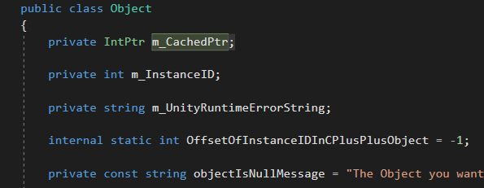

# C#의 null 체크 방법들

C#에서는 참조가 null인지 확인하기 위한 여러가지 방법들을 제공한다.

## C#의 비교 방법들

### == 사용

가장 보편적으로 사용되고 간단한 비교방법이다.

필드의 정보들을 비교해 반환한다. (객체의 정보가 같은지 확인한다.)

### Equals() 사용

기본적으로 ==과 같은역할을한다.

하지만 virtual 키워드가 존재해 오버라이딩이 가능하다.

### ReferenceEquals() 사용

두 변수의 참조를 비교한다. (같은 객체인지 확인한다.)

virtual 키워드가없어 오버라이딩이 불가능하다.

## C#의 null 확인

c#에서는 null을 편하게 확인하고 활용하는 문법을 제공한다.

### ?. 과 ?[].

### ??=

### ??

### is null 사용

# 유니티의 null 체크

유니티에서는 변수의 참조가 null값인지 확인해야하는 경우가 자주있다.

이런 상황에서 사용할수있는 여러가지 확인방법이 있다.

## Unity.Object와 C++네이티브 객체

유니티에서 우리가 사용하는 Unity.Object는 C++로 구현된 네이티브 객체를 래핑하는 객체이다.

유니티의 Object 객체는 자신의 C++ 네이티브객체의 포인터를 m_CachedPtr 변수를 통해 저장하고있다.

만약 Object.Destroy()를 호출해서 객체를 파괴한다면 m_CachedPtr이 참조하는 네이티브 객체가 파괴된다.

이때 본체인 네이티브 객체는 파괴되었지만, 개발자가 접근하는 C# 객체는 GC가 회수하기 전까지는 null이 아니기 때문에 생기는 문제를 막기위해 유니티는 fake null이라는 개념을 만들었다.

## fake null

## Unity.Object의 객체비교

### ==

### Equals()

### ReferenceEquals()

### GetInstanceID()

### GetHashCode()

## Unity.Object의 null 확인