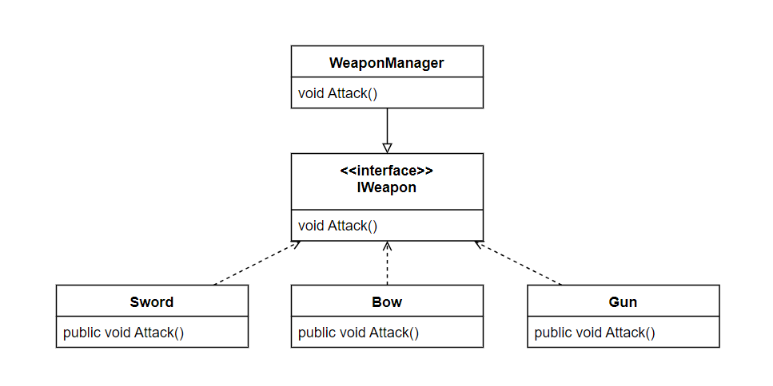

# Strategy Pattern

전략 패턴(Strategy Pattern)이란 객체들의 유사한 행동들을 캡슐화, 구현한 뒤 추상적인 접근점을 통해 구현된 행동을 실행하여 행동을 쉽게 변경, 추가할 수 있게 도와주는 디자인 패턴이다.

간단한 클래스 다이어그램으로 표현해보자면 Sword, Bow, Gun 클래스들은 IWeapon을 상속받고 각자 Attack 메서드를 구현한다. 이때 WeaponManager는 Sword, Bow, Gun 클래스들의 IWeapon을 참조하여 Attack 메서드를 실행한다. 이렇게 한다면 WeaponManager는 어떤 무기든간에 IWeapon이라는 추장적인 접근점을 통해서 무기의 행동을 실행할 수 있다.



---

# 전략 패턴 사용 예시

## 문제 예시

다음은 무기 시스템을 구현하였을 때 문제이다.

```csharp
using UnityEngine;

public class WeaponManager : MonoBehaviour
{
    enum WeaponType
    {
        Sword,
        Bow,
        Gun
    }

    WeaponType curWeaponType;

    void SetWeaponType(WeaponType weaponType) => curWeaponType = weaponType;

    void Attack()
    {
        switch (curWeaponType)
        {
            case WeaponType.Sword:
                Debug.Log("휘두르기");
                break;
            case WeaponType.Bow:
                Debug.Log("화살 발사");
                break;
            case WeaponType.Gun:
                Debug.Log("총알 발사");
                break;
        }
    }

    void SpecialAttack()
    {
        switch (curWeaponType)
        {
            case WeaponType.Sword:
                Debug.Log("바람의상처");
                break;
            case WeaponType.Bow:
                Debug.Log("수정화살");
                break;
            case WeaponType.Gun:
                Debug.Log("에임핵");
                break;
        }
    }
}
```

이렇게 무기 시스템을 구현한다면 코드가 늘어나고 가독성이 안좋아지며 무엇보다 개방 패쇄 원칙(OCP)을 어기게 된다. 이를 전략패턴 구현을 통해 해결할 수 있다.

---

## 전략패턴 구현

무기 클래스들이 가질 메서드를 IWeapon 인터페이스를 통해 캡슐화한다.

```csharp
public interface IWeapon
{
    void Attack();
    void SpecialAttack();
}
```

무기 클래스들은 IWeapon을 상속받고 각자 메서드를 구현한다.

```csharp
using UnityEngine;

public class Sword : IWeapon
{
    public void Attack() => Debug.Log("휘두르기");
    public void SpecialAttack() => Debug.Log("바람의상처");
}
```

```csharp
using UnityEngine;

public class Bow : IWeapon
{
    public void Attack() => Debug.Log("화살 발사");
    public void SpecialAttack() => Debug.Log("수정화살");
}
```

```csharp
using UnityEngine;

public class Gun : IWeapon
{
    public void Attack() => Debug.Log("총알 발사");
    public void SpecialAttack() => Debug.Log("에임핵");
}
```

Weapon 클래스에서는 무기 클래스들의 추장적인 접근점, 즉 IWeapon 인터페이스를 참조하여 무기 클래스들을 관리한다. 또한 SetWeaponStrategy 메서드를 통하여 무기의 종류를 바꿀 수 있게 한다.

```csharp
using UnityEngine;

public class Weapon : MonoBehaviour
{
    private IWeapon weapon;

    public void Attack() => weapon.Attack();
    public void SpecialAttack() => weapon.SpecialAttack();

    public void SetWeaponStrategy(IWeapon weapon) => this.weapon = weapon;
}
```

마지막으로 WeaponManager에서 Weapon 객체를 생성하고 Weapon 클래스의 메서드를 사용하여 무기를 관리한다.

```csharp
using UnityEngine;

public class WeaponManager : MonoBehaviour
{
    Weapon myWeapon = new Weapon();

    public enum WeaponType
    {
        Sword,
        Bow,
        Gun
    }

    public void SetWeapon(WeaponType weaponType)
    {
        switch(weaponType)
        {
            case WeaponType.Sword:
                myWeapon.SetWeaponStrategy(new Sword());
                break;
            case WeaponType.Bow:
                myWeapon.SetWeaponStrategy(new Bow());
                break;
            case WeaponType.Gun:
                myWeapon.SetWeaponStrategy(new Gun());
                break;
        }
    }

    public void Attack() => myWeapon.Attack();
    public void SpecialAttack() => myWeapon.SpecialAttack();
}
```

# 전략패턴의 장단점

## 장점

- 컨텍스트 코드의 수정없이 새로운 전략을 추가할 수 있다.
- 컨텍스트가 추상적인 접근점을 참조하고 있기에 전략 클래스의 변경이 용이하다.

## 단점

- 로직이 늘어날 때마다 전략 클래스가 늘어난다.

---

# 전략패턴을 공부하면서

- 처음 공부할 때 블로그 예시들이 구현하는 방식이 다 달라서 헷갈렸다.
- 잘쓰면 편하게 쓸 수 있을 것 같다.