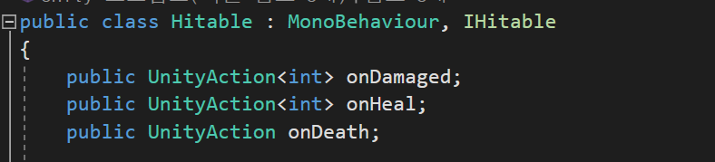

# UnityEvent와 UnityAction

이 두가지 클래스는 유니티에서 대리자를 편리하게 사용하기위해 제공하는 클래스이다.

# UnityEvent

UnityAction을 여러개참조하면서 원하는시점에 실행시킬수있는 관리용 클래스이다.

[serializedField] 등을 통해 인스펙터에 표시할수있으며 인스펙터에서 원하는함수를 넣어줄수있다.

## 기본기능

UnityEvent가 참조하는 이벤트들은 내부적으로 object배열에 저장된다.

### void Invoke()

자신이 참조하고있는 UnityAction들을 실행시킨다.

## 리스너관련기능

### void AddListner(UnityAction call)

call을 참조하기 시작한다. (이미 참조하고있어도 중첩가능하다.)

### void RemoveListner(UnityAction call)

자신이 참조하는 UnityAction들중 call과 동일한 이벤트를 모두 제거한다. (여러개있을경우 전부)

### void RemoveAllListner()

자신이 참조하는 모든 UnityEvent에 대한 참조를 종료한다.

### 이벤트관리기능

### int GetPersistentEventCount()

참조하는 UnityAction의 개수를 반환한다.

UnityAction이 아닌 일반적인 람다식을 참조할경우 그 람다식은 계산에서 제외한다.

### void SetPersistentListenerState(int index, UnityEventCallState state)

index번째 이벤트의 콜백조건을 설정한다. (꺼짐, 런타임중에만, 런타임 또는 에디터상에서)

### UnityEventCallState GetPersistentListenerState(int index)

index번째 이벤트의 콜백조건을 반환한다.

### string GetPersistentMethodName(int index)

index번째 이벤트의 함수이름을 반환한다.

### Object GetPersistentTarget(int index)

index번째 이벤트가 참조하는 메서드를가진 객체를 반환한다.

반환형이 object가 아닌 UnityEngine.Object이다.

# UnityAction

delegate를 통해 구현된 편의용 클래스이다.

UnityEvent가 참조하여 사용한다.

# 사용예시

피격기능담당 코드에서 이벤트를 제공하기위해 사용했다.