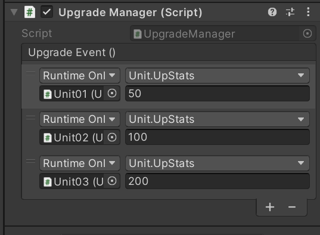
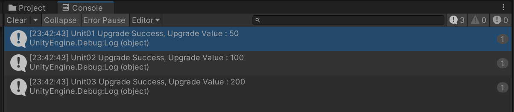

# UnityAction, UnityEvent

# UnityAction

UnityAction은 유니티에서 제공하는 delegate 형식으로 반환값이 없는 메서드에서 0~4개의 인자값을 받을 수 있다. 또한 UnityAction은 UnityEvent에서 사용할 수 있으며, C#의 Action과 사용방법은 같지만 C#의 Action보다 느리다.

## UnityAction 사용예시

사용예시는 플레이어가 무언가에 충돌했을 때 UnityAction을 사용하여 충돌에 관한 여러 메서드를 한번에 실행시키는 이벤트를 구현하였다.

```csharp
using UnityEngine;
using UnityEngine.Events;

public class Player : MonoBehaviour
{
    UnityAction hitEvents;

    public int hp;
    public bool isInvc;
    public GameObject hitEffect;

    private void Awake()
    {
        hitEvents += () => hp--;
				hitEvents += () => isInvc = true;
        hitEvents += () => Instantiate(hitEffect, transform.position, Quaternion.identity);
    }

    void OnCollisionEnter(Collision collision) => hitEvents.Invoke();
}
```


# UnityEvent

UnityEvent는 유니티에서 지원하는 이벤트 클래스로 원하는 상황에서 저장된 이벤트와 메서드를 실행할 수 있다. 또한 유니티 에디터 내의 인스펙터 창에서 확인, 설정할 수 있다. 다만 스크립트를 통해 수정된 사항은 인스펙터 창으로 확인할 수 없다. 

## UnityEvent 기능

### public void AddListener(UnityAction call)

- UnityEvent에 Listener를 추가한다.
- 일반적인 메서드를 매개변수에 넣어도 자동으로 UnityAction으로 치환된다.

### public void RemoveListener(UnityAction call)

- UnityEvent안에 해당하는 모든 이벤트를 삭제한다.

### public void RemoveAllListeners()

- UnityEvent안에 모든 이벤트를 삭제한다.

### public void Invoke()

- UnityEvent안에 모든 이벤트를 순차적으로 실행한다.

## UnityEvent 사용예시

사용예시는 각 유닛을 업그레이드 하는 이벤트를 구현하였다. 대신 UnityEvent의 특징인 에디터의 인스펙터 창에서 수정할 수 있는 점을 이용하였다.

**업그레이드 매니저 클래스 구현**

```csharp
using UnityEngine;
using UnityEngine.Events;

public class UpgradeManager : MonoBehaviour
{
    public UnityEvent UpgradeEvent;

    private void Update()
    {
        if (Input.GetKeyUp(KeyCode.Space)) UpgradeEvent.Invoke();
    }
}
```

**유닛 클래스 구현**

```csharp
using UnityEngine;
using UnityEngine.Events;

public class Unit : MonoBehaviour
{
    public int hp;
    public int damage;

    public void UpStats(int upValue)
    {
        hp += upValue;
        damage += upValue;

        Debug.Log(gameObject.name +" Upgrade Success, Upgrade Value : " + upValue);
    }
}
```

이후 인스펙터 창에서 유닛 클래스가 들어간 오브젝트를 선택해 UpStats() 메서드를 참조하면 유니티 이벤트를 통해 인스펙터 창에서 각 유닛들의 업그레이드를 관리할 수 있다.




## 하면서 들었던 생각?

- ~~컨퍼런스는 일찍 일찍 해놓자~~
- UnityAction은 UnityEvent에 사용할게 아니라면 C# Action을 쓰는게 좋을 것 같다.
- UnityEvent는 인스펙터 창에서 수정할 수 있는 부분은 좋았지만 스크립트로 수정됐을 땐 인스펙터 창에서 확인할 수 없는 부분과 UnityAction 추가는 오직 스크립트에서 가능한 부분이 아쉬웠다.
- 위의 이유 때문에 버튼 구현 외에는 실질적으로 UnityEvent를 어디에 사용해야 하는지 왜 사용해야 하는지 모르겠다.